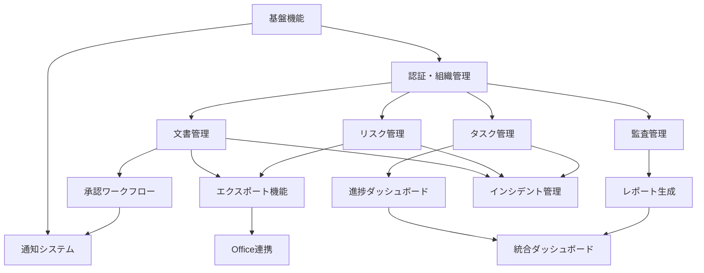

# ISMSプロセス支援機能 実装計画書

## 1. エグゼクティブサマリー

本計画書は、ISMS（ISO/IEC 27001）の認証取得から運用までの全プロセスを支援するSaaSアプリケーションの機能実装計画を定めたものです。既存実装の70%を基盤として、残り30%の重要機能を段階的に実装することで、実用的なISMS支援ツールを構築します。

## 2. 実装方針

### 2.1 基本原則
1. **実用性重視**: 形式的な機能より実際の業務で使える機能を優先
2. **段階的リリース**: MVPから始めて段階的に機能拡張
3. **既存資産活用**: 実装済み機能を最大限活用
4. **ユーザビリティ**: 直感的で使いやすいUI/UX
5. **データポータビリティ**: 既存ツール（Excel/Word）との互換性確保

### 2.2 技術方針
- Next.js 14 + TypeScript（安定性重視）
- Supabase（認証・DB・ストレージ統合）
- 多言語対応（日本語・英語）
- レスポンシブデザイン

## 3. ISMSプロセスと必要機能のマッピング

### 3.1 準備フェーズ支援機能

| ISMSプロセス | 必要機能 | 実装状況 | 優先度 |
|------------|---------|---------|-------|
| プロジェクト立ち上げ | プロジェクト管理 | 📅 計画中 | 中 |
| | 体制図管理 | ✅ 実装済 | 中 |
| | 方針文書テンプレート | 🚧 進行中 | 高 |
| スコープ定義 | 適用範囲登録 | ✅ 実装済 | - |
| | 資産台帳 | ✅ 実装済 | 高 |
| ギャップ分析 | チェックリスト | ✅ 実装済 | - |
| | ギャップ分析レポート | 🚧 進行中 | 高 |

### 3.2 構築フェーズ支援機能

| ISMSプロセス | 必要機能 | 実装状況 | 優先度 |
|------------|---------|---------|-------|
| 文書体系構築 | 文書管理 | ✅ 実装済 | - |
| | 文書テンプレート | 🚧 進行中（Seed完了・生成フロー調整中） | 高 |
| | 承認ワークフロー | ✅ 実装済（2段階承認・兼務スキップ対応） | 高 |
| | Word/PDFエクスポート | 🚧 QA中 | 最高 |
| リスクアセスメント | リスク登録・評価 | ✅ 実装済 | - |
| | リスク対応計画 | ✅ 実装済 | - |
| | Excelエクスポート | ✅ 実装済（2025-11-12 完了） | 最高 |
| 管理策実装 | タスク管理 | ✅ 実装済 | - |
| | 進捗ダッシュボード | 🚧 進行中 | 高 |
| | 管理策ライブラリ | ✅ 実装済 | 中 |
| 教育・訓練 | 教育管理 | ❌ 未実装 | 中 |
| | eラーニング | ❌ 未実装 | 低 |
| | 受講記録 | ❌ 未実装 | 中 |

### 3.3 認証審査フェーズ支援機能

| ISMSプロセス | 必要機能 | 実装状況 | 優先度 |
|------------|---------|---------|-------|
| 内部監査 | 監査計画 | ✅ 実装済（期間セレクター/進捗バッジ含む） | 最高 |
| | 監査チェックリスト | ✅ 実装済 | 最高 |
| | 不適合管理 | ✅ 実装済 | 最高 |
| | 監査報告書生成 | ✅ 実装済 | 最高 |
| | Dev Login シード | ✅ 実装済 | 高 |
| | 監査ログ連携 | ✅ 完了 | 高 |
| マネジメントレビュー | レビュー記録 | ❌ 未実装 | 中 |
| | KPIダッシュボード | ❌ 未実装 | 中 |
| 認証審査対応 | 審査準備チェックリスト | ❌ 未実装 | 中 |
| | 文書一覧出力 | 🚧 進行中 | 高 |

### 3.4 運用フェーズ支援機能

| ISMSプロセス | 必要機能 | 実装状況 | 優先度 |
|------------|---------|---------|-------|
| 日常運用 | インシデント管理 | ✅ 実装済み | 高 |
| | 変更管理 | ❌ 未実装 | 中 |
| | アクセスログ | ⚠️ 一部実装 | 中 |
| 定期活動 | 定期レビュー管理 | ❌ 未実装 | 中 |
| | 改善提案管理 | ❌ 未実装 | 低 |
| 維持審査 | 審査スケジュール | ❌ 未実装 | 低 |
| | 継続的改善記録 | ❌ 未実装 | 中 |

## 3.5 EARS形式 実装要件定義

### 3.5.1 オンボーディング・セットアップ要件

#### イベント駆動要件
- EARS-IMPL-001: When 組織管理者が初期セットアップウィザードを完了したとき、the system shall 組織設定・ユーザー招待・ISMSフェーズ選択を一括で記録し、Plan Tracking の Phase1 チェックポイントを自動的に `completed` に遷移させる。
- EARS-IMPL-002: When System Operatorが初回ログインしたとき、the system shall オンボーディングウィザードを表示し、組織基本情報の入力を促す。
- EARS-IMPL-003: When オンボーディングが完了していない組織のユーザーがダッシュボードにアクセスしたとき、the system shall オンボーディング進捗バナーを表示し、残りの設定項目を案内する。

### 3.5.2 リスク管理要件

#### イベント駆動要件
- EARS-IMPL-010: When リスクアセスメントが開始され、情報資産台帳とリンクしたリスクが登録されたとき、the system shall 影響度・発生可能性・対応方針を必須項目として保存し、タスク・管理策モジュールへ相互参照リンクを生成する。
- EARS-IMPL-011: When リスク評価マトリクスでセルがクリックされたとき、the system shall 当該リスクレベルに該当するリスク一覧をフィルタ表示する。
- EARS-IMPL-012: When リスク対応計画が作成されたとき、the system shall 対応タスクを自動生成し、担当者への通知を送信する。
- EARS-IMPL-013: When リスクExcelエクスポートが要求されたとき、the system shall Annex A管理策との紐付けを含む形式でExcelファイルを生成する。

### 3.5.3 文書管理要件

#### イベント駆動要件
- EARS-IMPL-020: When 文書承認ワークフローで承認または差し戻しが行われたとき、the system shall 承認履歴と証跡ファイルを Supabase Storage に保存し、同じイベントを通知・ダッシュボード指標に即時反映する。
- EARS-IMPL-021: When 文書が最終承認されたとき、the system shall 文書ステータスを「承認済み」に更新し、関係者に承認完了通知を送信する。
- EARS-IMPL-022: When 文書Word/PDFエクスポートが要求されたとき、the system shall テンプレートに基づいてフォーマットし、ダウンロード可能な状態で提供する。
- EARS-IMPL-023: When 文書のバージョン数が上限（5件）を超えたとき、the system shall 超過分を課金対象として記録し、管理者に通知する。

### 3.5.4 監査管理要件

#### イベント駆動要件
- EARS-IMPL-030: When 内部監査計画が完了状態へ遷移したとき、the system shall 監査ログ・是正処置タスク・レポート出力へのリンクをまとめた監査サマリーを生成し、経営層向けダッシュボードへ「監査完了」バッジを表示する。
- EARS-IMPL-031: When 監査チェックリストで不適合が検出されたとき、the system shall 不適合レコードを作成し、是正処置タスクの生成を促すダイアログを表示する。
- EARS-IMPL-032: When 監査報告書PDF出力が要求されたとき、the system shall チェックリスト結果・不適合一覧・是正処置状況を含むPDFを生成する。
- EARS-IMPL-033: When 監査証跡ファイルがアップロードされたとき、the system shall 組織ID/チェックリストIDを含むパスで保存し、署名付きURLを発行する。

### 3.5.5 タスク管理要件

#### イベント駆動要件
- EARS-IMPL-040: When タスクが作成されたとき、the system shall 担当者に通知を送信し、ダッシュボードの「未完了タスク」カウントを更新する。
- EARS-IMPL-041: When タスクの期限が3日以内に迫ったとき、the system shall 担当者にリマインダー通知を送信する。
- EARS-IMPL-042: When タスクが期限超過したとき、the system shall 管理者にエスカレーション通知を送信し、ダッシュボードで警告表示する。
- EARS-IMPL-043: When タスクが完了としてマークされたとき、the system shall 完了日時を記録し、関連するリスク・監査項目のステータスを確認する。

### 3.5.6 通知・連携要件

#### イベント駆動要件
- EARS-IMPL-050: When 通知イベント（承認依頼、期限リマインダー等）が発生したとき、the system shall アプリ内通知を作成し、メール送信設定が有効な場合はメールも送信する。
- EARS-IMPL-051: When ユーザーが通知設定を変更したとき、the system shall 設定を保存し、以降の通知配信に反映する。
- EARS-IMPL-052: When Slack/Teams連携が設定されている場合に通知イベントが発生したとき、the system shall 設定されたチャンネルに通知を投稿する。

### 3.5.7 ダッシュボード・レポート要件

#### イベント駆動要件
- EARS-IMPL-060: When ユーザーがダッシュボードにアクセスしたとき、the system shall ロールに応じた表示内容（タスク、リスク、監査、KPI）を構成して表示する。
- EARS-IMPL-061: When KPIデータが更新されたとき、the system shall ダッシュボードの指標をリアルタイムで更新する。
- EARS-IMPL-062: When マネジメントレビュー資料の出力が要求されたとき、the system shall リスク状況・監査結果・タスク進捗を集約したWord/PDFを生成する。

### 3.5.8 EARS要件ID一覧（実装計画）

| カテゴリ | ID範囲 | 件数 |
|---------|--------|------|
| オンボーディング | EARS-IMPL-001 〜 003 | 3件 |
| リスク管理 | EARS-IMPL-010 〜 013 | 4件 |
| 文書管理 | EARS-IMPL-020 〜 023 | 4件 |
| 監査管理 | EARS-IMPL-030 〜 033 | 4件 |
| タスク管理 | EARS-IMPL-040 〜 043 | 4件 |
| 通知・連携 | EARS-IMPL-050 〜 052 | 3件 |
| ダッシュボード | EARS-IMPL-060 〜 062 | 3件 |
| **合計** | | **25件** |

## 4. 機能間の依存関係分析



## 5. 段階的実装計画

### Phase 1: MVP 完成（完了）
**状態**: コア導線（文書・リスク・タスク・監査・通知）のウォーキングスケルトンは稼働中。残る作業は QA と翻訳網羅。

- ✅ 文書承認ワークフロー（2段階承認・バージョン管理）
- ✅ リスク登録／評価／マトリクス表示
- ✅ タスク CRUD と通知連携基盤
- ✅ 監査チェックリスト〜不適合管理の縦断導線
- 🚧 文書／監査エクスポート QA（Word/PDF）
- 🚧 通知メール連携・翻訳キー網羅

### Phase 2: 基本機能拡張（2025Q4〜2026Q1）
**目標**: リスク・監査・運用ダッシュボードの強化とレポート基盤の整備。

#### ストリームA: リスク & 監査拡張（オーナー: プロダクトチーム）
- ✅ リスク PDF/Excel エクスポート（Annex A 管理策との紐付け、テンプレート確定。`/api/risks/export?format=` で 2025-11-12 完了）
- 🚧 監査報告書 PDF 出力（レイアウト、証跡サマリー）
- 📅 ギャップ分析レポート自動配信（メール/Storage 配信）

#### ストリームB: 運用基盤（オーナー: プラットフォームチーム）
- 🚧 タスクダッシュボード拡張（リスト/かんばん切り替え、フィルタ永続化）
- 🚧 通知メール/Slack 連携（Edge Function + Resend）
- 📅 インシデント管理 MVP（登録・分類・エスカレーション）

#### ストリームC: レポート整備（オーナー: データチーム）
- 📅 経営ダッシュボード KPI 初版（リスク／監査／タスク指標の集約）
- 📅 マネジメントレビュー資料のテンプレート化（Word/PDF）
- 📅 エクスポート共通ライブラリ整備（文書・リスク・タスク共通化）

> 注記: Week 5-6 で計画していた「文書管理ビュー」「リスク登録・評価」「ギャップ分析ツール」「資産管理台帳」「管理策ライブラリ」は 2025-10-12 時点で完了済み（`✅` 表記へ反映済み）。

### Phase 3: 運用支援強化（2026Q1〜Q2）
**目標**: 教育・定着・改善活動の自動化と高度レポートを提供。

#### ストリームD: 教育・定着
- 📅 教育計画／受講管理モジュール
- 📅 eラーニング連携（教材アップロード／進捗トラッキング）
- 📅 教育効果測定レポート

#### ストリームE: 継続改善
- 📅 是正・予防処置管理の自動テンプレート化
- 📅 根本原因分析ツール（5Why / Fishbone）
- 📅 継続的改善バックログの可視化

#### ストリームF: 高度レポート
- 📅 KPI トレンド分析 + 時系列可視化
- 📅 マネジメントレビュー支援（議事録テンプレート、アクション管理）
- 📅 全社監査レポート一括出力（PDF/Excel）

## 6. 2025-10-14 実施タスクリスト（ウォーキングスケルトン完了目標）

| タスクID | ロール | ゴール | 対応範囲 | 依存関係 | 完了条件 |
|----------|--------|--------|----------|----------|----------|
| 11 | 組織管理者 (Org Admin) | Stripe 課金ウォーキングスケルトンの本番相当導線を確立 | Price ID 自動反映、Webhook 受信、Checkout/Portal 導線、ユースケース UC-02 の残項目 | UC-01 招待導線、Supabase 課金スキーマ | `pricing_plans.stripe_price_id` が環境変数で充填され、`stripe listen` + テスト決済で `subscriptions`/`payment_history` が更新されるログを残すこと |
| 12 | システム運営者 (System Operator) | 設定・権限 UI を用いて体制管理とアクセス制御を完了できる | `/ja/settings/organization` 体制図管理、ロール権限編集、メール認証時のフォールバック整理 (UC-09) | OR-01 招待フロー、ProjectStructureManager | 必須ロールの割当完了でオンボーディング進捗が 100% となり、アクセス制御が反映されるスクリーンショットと QA ログ |
| 13 | 一般ユーザー / 承認者 | タスク・文書ワークフローと通知連携を通しで確認 | タスク CRUD、文書閲覧/ダウンロード、通知（アプリ内/メール）の再検証、UC-04/06 の未チェック項目 | UC-01・UC-02、通知サービス | Playwright シナリオ追加＋ UC チェックリスト更新。通知ログとダウンロード確認ログを記録 |
| 14 | 監査員 | 監査報告書の PDF 出力と容量運用ガイドを整備 | `/audit/plans/[planId]/report` の PDF エクスポート、容量超過時のガイド整備、UC-07 未完タスク | AuditService、StorageQuota | PDF ファイル生成テスト、docs/06-operations/ に運用手順追記、UC チェックリスト更新 |
| 15 | システム運営者 / 全ロール | Stripe/設定/文書/監査の検証ログを集約し、PR と mpl_report.md に反映 | `docs/02-project/12_uc-checklist.md`、`docs/02-project/progress.json`、`docs/02-project/mpl_report.md` 更新、make test / make lint / npm run e2e:ci | タスク 11〜14 | すべてのチェックリストが更新され、PR 草案に検証ログを掲載 |

> 上記タスクは順番に実施し、各タスク完了時に `docs/02-project/12_uc-checklist.md`・`docs/02-project/progress.json` を更新してコミット (`codex: task N done`) とタグ付け (`codex/ckpt-N`) を行う。

## 6.1 2025-11 改善タスク（レビュー第2回）

| タスク | 概要 | ブランチ案 | 参照 | 備考 |
| --- | --- | --- | --- | --- |
| リスク評価データ整備 | デモリスク 5 件投入、情報資産/業務タスク紐付け UI、`assessment_period` 表示 | `feature/risk-period-filter` | `docs/02-project/archive/90_2025-11-08_risk-task-audit-review.md` | ✅ 完了（Issue #190） |
| タスクサンプル & 一覧拡張 | サンプルタスク 3 件、責任者/完了条件/期限表示強化 | `feature/task-sample-data` | 同上 | ✅ 完了（Issue #125） |
| 監査期間ヘッダー | 年度/四半期セレクター、ステータスバッジ強化 | `feature/audit-period-header` | 同上 | ✅ 完了（Issue #141/#142） |
| 共通期間・状態 UI | `FilterBar`/`StatusFilterBanner` 共通化、ダミーデータ投入コマンド | `feature/common-period-filter` | `docs/07-design-system/ui-guidelines.md` | ✅ 完了（Issue #104） |

### 6.2 フェーズ選択（ISMSサイクル設定）✅ 完了

| タスク | 概要 | ブランチ案 | 依存 | 完了条件 |
| --- | --- | --- | --- | --- |
| 要件整理 | `organizations` に `isms_phase`（`initial`/`surveillance`）を追加し、`docs/01-business/isms-process-detailed.md` と整合させる | `docs/phase-setting-plan` | 本ドキュメント更新 | ✅ 完了（Issue #106） |
| UI/UX 設計 | System Operator が初回ログインまたは `/settings/organization` でフェーズを選択するウィザードを設計 | `design/phase-setup` | 要件整理 | ✅ 完了（Issue #130） |
| 機能実装計画 | OnboardingService / Dashboard / Checklist をフェーズ別に出し分ける設計を記述 | `feature/phase-selector` | 要件整理 | ✅ 完了（Issue #166） |

> 2025-11-13 にすべてのタスクが完了。

## 6. 監査ワークフロー拡張計画（2025-10-15更新）

ウォーキングスケルトンで監査員が「Dev Login → 監査ダッシュボード → 証跡・不適合管理 → 報告書作成」まで通せる状態を目指し、以下の課題と対応策を実装順に整理する。

1. **アクセス制御と共通基盤**
   - 監査ページ共通ガードとダッシュボードナビの制御を追加し、`auditor` 権限が無いユーザーを遮断する。
   - Supabase 型定義に監査テーブル群を追記し、`AuditService` と `PermissionService` に監査ログ記録を統合する。
2. **監査計画管理 UI**
   - `/[locale]/audit/plans/[planId]` 詳細ページを新設し、ステータス遷移・チーム管理・実績日付入力を可能にする。
   - 新規作成ページの候補ユーザー条件を `auditor/org_admin/system_operator/approver` に修正し、作成後は詳細へ遷移させる。
3. **ISO要件とチェックリスト管理**
   - 要求事項ツリー閲覧・適用可否トグル・チェックリスト一括生成を追加し、`bulkCreateChecklists` を実装する。
   - チェックリスト画面に検索／担当者フィルタ／編集ドロワーを実装し、証跡アップロード・不適合作成と連携する。
4. **不適合・是正処置管理**
   - 不適合一覧ページと詳細編集パネルを追加し、是正処置 CRUD を UI から実行できるようにする。
   - チェックリスト詳細から不適合登録モーダルを提供し、`nc_number` 採番とタスク案内を行う。
5. **監査証跡ストレージ修正**
   - 証跡ファイルパスに組織 ID / チェックリスト ID を含める形へ統一し、署名付き URL を返却する。
   - Storage ルールと運用ガイドを更新し、`get_organization_storage_usage` の集計と整合させる。
6. **監査報告書と完了処理**
   - レポート編集ページを新設し、保存時に監査計画ステータス更新オプションを提供する。
   - PDF 出力は将来課題として TODO 表記し、プレースホルダを明示する。
7. **監査ダッシュボード拡充**
   - チェックリスト完了率・是正処置進捗カードや「次のアクション」セクションを追加する。
   - 権限不足時の警告カードを実装し、アクセスガードと連携する。
8. **Dev Login / Seed 整備**
   - Auditor シナリオに監査計画・チェックリスト・不適合・報告書の初期データを投入し、権限フラグ `can_manage_audit` を付与する。
   - `scripts/test-audit.js` に監査ルート巡回チェックを追加する。
9. **E2E / QA**
   - `tests/e2e/audit-walkthrough.spec.ts` を追加し、チェックリスト→不適合→証跡→報告書まで自動化する。
   - 既存 E2E への影響を確認し、`package.json` の `test:e2e` に新 spec を含める。
10. **ドキュメント・翻訳整備**
    - `messages/en.json` / `ja.json` と `docs/02-project/*` を更新し、監査フローの完了条件と QA 手順を記載する。
    - README / 開発ガイドに Dev Login シード更新内容を追記する。

> 上記完了後に監査ウォーキングスケルトンの手動確認と Playwright 実行を行い、`docs/05-quality/uc-validation-20250918.md` に結果を追記する。

### Phase 4: 高度化（4ヶ月目以降）
**目標**: 差別化機能と自動化

#### 追加機能候補
- [ ] AI支援リスク評価
- [ ] 自動監査スケジューリング
- [ ] 外部連携（Slack/Teams）
- [ ] モバイルアプリ
- [ ] 高度なレポーティング

## 7. 実装優先順位マトリクス

| 優先度 | ビジネス価値 | 実装難易度 | 機能カテゴリ |
|-------|------------|----------|------------|
| 最高 | 高 | 低 | エクスポート機能、ワークフロー |
| 高 | 高 | 中 | ギャップ分析、インシデント管理 |
| 中 | 中 | 中 | 教育管理、KPI分析 |
| 低 | 低 | 高 | AI機能、外部連携 |

## 7. 技術的実装アプローチ

### 7.1 エクスポート機能
```typescript
// 実装例: Wordエクスポート
- ライブラリ: docx
- 実装箇所: /app/api/export/word/route.ts
- テンプレート: /templates/word/

// 実装例: Excelエクスポート  
- ライブラリ: exceljs
- 実装箇所: /app/api/export/excel/route.ts
- テンプレート: /templates/excel/
```

### 7.2 ワークフロー実装
```typescript
// DocumentService submitApprovalRequest の一部
await supabase.from('document_approvals').insert([
  { document_id, step: 1, approver_id: step1, status: skippedIfSame },
  { document_id, step: 2, approver_id: step2, status: 'pending' }
])

await NotificationService.createDocumentApprovalRequest(
  organizationId,
  step2,
  document.title,
  documentId,
  requesterId
)
```

```sql
-- バージョン超過課金と保持期限を自動管理
CREATE OR REPLACE FUNCTION refresh_document_version_usage(p_org UUID) RETURNS void AS $$
  PERFORM update_usage_tracking(p_org, 'document_versions_extra', usage_value);
$$ LANGUAGE plpgsql;

CREATE OR REPLACE FUNCTION prune_expired_documents() RETURNS INTEGER AS $$
  DELETE FROM documents WHERE retention_delete_at <= NOW();
$$ LANGUAGE plpgsql;
```

### 7.3 ダッシュボード改善
```typescript
// リアルタイムデータ取得
- Supabase Realtime購読
- サーバーコンポーネントでの初期データ取得
- クライアントでのリアルタイム更新
```

## 8. リスクと対策

| リスク | 影響 | 対策 |
|-------|-----|-----|
| Supabase制限 | パフォーマンス低下 | キャッシュ戦略、接続プール最適化 |
| 複雑なワークフロー | 開発遅延 | 段階的実装、シンプルなMVP |
| Office形式の互換性 | ユーザー不満 | 十分なテスト、複数バージョン対応 |
| スケーラビリティ | 成長制限 | アーキテクチャの見直しポイント設定 |

## 9. 成功指標（KPI）

### 技術指標
- ページロード時間: < 2秒
- API応答時間: < 500ms
- エクスポート処理: < 10秒
- システム稼働率: > 99.5%

### ビジネス指標
- 機能完成度: Phase 1で80%、Phase 3で95%
- ユーザー満足度: > 4.0/5.0
- 月間アクティブユーザー増加率: > 20%
- チャーン率: < 5%

## 10. 次のアクション

1. **即時実行（今週）**
   - エクスポート機能の詳細設計
   - 必要なライブラリの調査・選定
   - テンプレート作成開始

2. **短期実行（2週間以内）**
   - Phase 1の実装開始
   - テスト環境の準備
   - ユーザーフィードバック収集体制構築

3. **中期計画（1ヶ月以内）**
   - Phase 1完了とリリース
   - Phase 2の詳細計画策定
   - パフォーマンステスト実施

## 11. 現行イテレーション計画（2025-10-12）

| タスクID | 内容 | 完了基準 | 検証コマンド | 見積(分) |
| --- | --- | --- | --- | --- |
| 1 | 残ギャップの現状整理（セクション3/5の未実装機能を棚卸し） | `docs/02-project/archive/90_2025-10-12_replan.md` に現状サマリー表が作成され、未完了機能がカテゴリ別に列挙されている | `rg "現状サマリー" docs/02-project/archive/90_2025-10-12_replan.md` | 40 |
| 2 | 優先度とフェーズの再編（マッピング表の更新） | セクション3のステータス／優先度、セクション5のフェーズ ToDo が最新計画に合わせて更新されている | `rg "✅" docs/02-project/02_implementation-plan.md` | 45 |
| 3 | 実装ロードマップ案の作成 | `docs/02-project/archive/90_2025-10-12_replan.md` に四半期ベースのロードマップと依存関係図が追加されている | `rg "ロードマップ" docs/02-project/archive/90_2025-10-12_replan.md` | 50 |
| 4 | 進行ドキュメント更新（progress.json / mpl_report.md / UC チェックリスト要否確認） | `docs/02-project/progress.json` にタスク1-3の履歴が追加され、`docs/02-project/mpl_report.md` に再計画の概要と検証ログが追記されている | `rg "再計画" docs/02-project/mpl_report.md` | 30 |
| 5 | ビルド/テスト自動化コマンドの整備（Makefile と `npm run e2e:ci` の追加） | `Makefile` に `test`/`lint` を追加し、`npm run e2e:ci` が存在。`make lint` と `make test` が正常終了する | `make lint && make test` | 40 |
| 6 | 実装計画・UCチェックリストの整合更新（資産管理台帳・管理策ライブラリの達成反映） | `docs/02-project/02_implementation-plan.md` と `docs/02-project/12_uc-checklist.md` に最新の達成状況が反映され、資産管理台帳・管理策ライブラリ・ギャップ分析のステータスが完了扱いになる | `rg "資産管理台帳" docs/02-project/02_implementation-plan.md` | 30 |
| 7 | レポート・PR準備（進捗ログと最終報告の作成） | `docs/02-project/mpl_report.md` に今回の変更理由・内容・検証結果が記録され、PR 下書きコメントが用意されている | `rg "2025-10-12" docs/02-project/mpl_report.md` | 25 |
| 8 | リスク一覧ページのE2E検証追加 | Dev Loginでorg_adminとしてログインし、`/ja/risks` の空状態メッセージと新規登録導線が表示される Playwright テストが追加・成功している | `npx playwright test tests/e2e/risks.spec.ts` | 35 |
| 9 | タスク一覧ページのE2E検証追加 | Dev Loginでorg_adminとしてログインし、`/ja/tasks` の主要ウィジェットが表示される Playwright テストが追加・成功している | `npx playwright test tests/e2e/tasks.spec.ts` | 40 |
| 10 | UCチェックリストとレポート更新（リスク/タスクの検証結果反映） | `docs/02-project/12_uc-checklist.md` と `docs/02-project/mpl_report.md` にリスク/タスクの検証完了を追記し、progress.json が更新されている | `rg "2025-10-12" docs/02-project/12_uc-checklist.md` | 25 |
