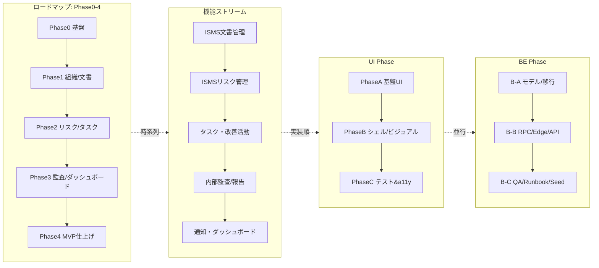

作成日: 2025-06-02 (tom)
更新日: 2026-01-21 (PO 決定反映)
記録者: Claude Code

# Riscala AI for ISMS 開発計画・進捗管理

## 全体フェーズ俯瞰（ロードマップ × 機能ストリーム × UI/BE）

- **ロードマップ Phase 0〜4**: プロダクト全体のマイルストーン（基盤→組織/文書→リスク/タスク→監査/ダッシュボード→MVP 最終調整）。本ドキュメント下部の進捗表を参照。
- **機能ストリーム**: 文書・リスク・タスク・監査・通知など、`docs/02-project/02_implementation-plan.md` で整理しているモジュール単位の施策列。
- **UI 実装ステップ A/B/C**: `docs/07-design-system/ui-screens-and-flows.md` で定義した基盤→ビジュアル→テスト/a11y の 3 段階。Plan Tracking の各課題に「Phase B 未完」などで紐付け。
- **バックエンド実装ステップ B-A/B-B/B-C**: データモデル/マイグレーション → RPC・Edge Function → QA/Runbook（Super Admin などで運用中）。Plan Tracking では課題メモに BE 状態も併記する方針。

| レイヤー | 役割 | 代表ドキュメント |
| --- | --- | --- |
| ロードマップ Phase 0〜4 | 全体マイルストーン・進捗率 | 本ファイル（進捗表）/ `docs/02-project/01_roadmap.md` |
| 機能ストリーム | モジュール別の施策列と依存関係 | `docs/02-project/02_implementation-plan.md` |
| UI Phase A/B/C | 画面側の実装段階 | `docs/07-design-system/ui-screens-and-flows.md` |
| BE Phase B-A/B-B/B-C | データ/サービス/QA の段階 | `docs/02-project/archive/90_2025-11-07_rbac-ui-review.md` 等実装ログ |

※ 本 Plan Tracking では各課題の「UI Phase」「BE Phase」「ロードマップ Phase」を並記することで、どの層が未完かを明示する。

## 更新サマリー（2026-01-21）
- **2026-01-21 PO 決定事項を追記**: MVP範囲、部門スコープタイミング、高度化機能優先順位、テナント削除方針を確定。
- **Repository Pattern インフラ完了**: Phase 1-3 の Repository pattern + SQLite 対応が main にマージ完了 (コミット ccd7b31 → 2fab18c)。
- **コードマップ更新完了**: `codemaps/` ディレクトリに最新のアーキテクチャ・バックエンド・フロントエンド・データ構造ドキュメントを追加。
- **未完了タスクの棚卸し**: Phase 4 MVP最終調整の残タスクを整理し、実装計画を明確化。

## 更新サマリー（2026-05-14 release-readiness補正）
- **初回評価の補正**: release-readiness初回評価はUC・既存docs・実装資産の存在確認に寄っており、ISMS新規導入/継続運用/SaaS運営の実務工程起点として不足があったため、補正後スコアを **41/100** とする。
- **正本成果物を追加**: `docs/02-project/release-readiness/isms-operational-workflow-model.md`、`required-capability-matrix.md`、`capability-gap-assessment.md`、`operational-efficiency-review.md` を追加し、工程2/3/5の再評価基準とした。
- **対象工程を拡張**: 工程2・3・5だけでなく、正本確定、規格/運用ナレッジ整理、業務ルール検証、採点、終了判定にも影響するため、工程0/1/4/8/9も補正対象に含める。
- **リリース阻害要因**: `qa:security` critical/high、unit test TS build失敗、Playwright browser未導入、localhost QA timeout、テナント/RBAC否定ケース未確認をP0/P1中心に継続管理する。

## 2026-01-21 PO 決定事項

| 項目 | 決定内容 | 備考 |
| --- | --- | --- |
| MVP範囲 | **標準MVP** | パフォーマンス最適化 + セキュリティスキャン + デモ環境準備を含む。負荷テスト・キャッシュ戦略は後回し |
| 部門スコープ権限 | **MVPリリース後に実装** | 基本フィルタのみでMVPリリース。部門選択UIは有料顧客フィードバック後に実装 |
| 高度化機能優先順位 | **外部連携（Webhook汎用化）優先** | Phase 5 では Zapier/Make 等との連携を最優先。AI支援・モバイルは後続 |
| テナント削除方針 | **論理削除のみ** | `deleted_at` フラグで非表示。データ復旧可能、監査証跡保持。物理削除は行わない |

## 更新サマリー（2025-12-24）
- **ドキュメント整合性チェック完了**: 2025-12-01 に完了した以下の 6 タスクを「完了事項」セクションに移動し、各ドキュメントのチェックボックスを更新。
  1. 設定画面のトースト統一（コミット cce0077）
  2. 組織設定UX回帰の解消（コミット 542f23f）
  3. 管理策テンプレ投入ウィザード（コミット 584993f）
  4. リスクマトリクスのドリルダウン（2025-11-16 以前実装）
  5. 資産CSV Roundtrip（コミット e87c332）
  6. Dev Login プロファイル永続化（コミット 542f23f, 1ca6513）
- **監査期間ヘッダー**: 「未対応事項」セクションでステータスを「未着手」から「✅ 完了」に更新（2025-11-11, Issue #141/#142）。
- **設計ドキュメント更新**: 上記 4 件の設計ドキュメント（`90_2025-11-18_*.md`）のタスクチェックボックスをすべて `[x]` に更新し、実装日とコミットハッシュを追記。
- **未対応事項の整理**: 部門スコープ統合（将来対応）、ロードマップ最小タスク（企画段階）が残課題として明確化。
- **ドキュメント整合性チェック（#9）完了**: `01_roadmap.md` / `02_implementation-plan.md` を Plan Tracking と同期し、完了済みタスク（監査期間セレクター、ISMS フェーズ選択、統計カードリンク等）のステータスを反映。両ドキュメントの `last_updated` を 2025-12-24 に更新。

## 更新サマリー（2025-11-13）
- Issue #185（Lighthouse/性能+セキュリティ計測の自動化）で `npm run qa:lighthouse` と `npm run qa:security` を追加。E2E_MODE=1 の dev サーバーに対して `/ja/home,/ja/risks,/ja/tasks,/ja/audits,/ja/documents` を Lighthouse CI で計測し、Performance 85 / Accessibility 90 / Best Practices 90 / SEO 90 を既定閾値として `test-results/lighthouse/<ts>/summary.json` へ保存する運用に統一した。CI では短縮ルートで日次実行し、週次（毎週月曜 09:00 JST）は全ルート＋3回走査。
- `npm run qa:security` は `npm audit --json` と OSV Batch API をまとめて実行し、`test-results/security/` に `npm-audit-*.json`, `osv-scan-*.json`, `security-summary-*.json` を保存する。CI では `QA_SECURITY_FAIL_ON=high` を指定し、High 以上の脆弱性検出でジョブを失敗させる。ローカルは `QA_SECURITY_FAIL_ON=none` で記録のみ行い、既知のアラートは handoff にリンクを残す。
- `docs/05-quality/qa-guidelines.md` にパフォーマンス／セキュリティ QA の手順・閾値・証跡格納先・環境変数を追記し、Plan Tracking Phase4「性能/セキュリティ計測未整備」の行を ✅ へ更新。CI mainline（Issue #176）に新ジョブ `qa-performance-security` を追加する前提準備が整った。

## 更新サマリー（2025-11-11）
- Issue #137（オンボーディング進捗 API/ウィジェット刷新）で `lib/services/onboarding.ts` を年度別サマリーに対応させ、Home の OnboardingChecklist に年度タブとステータスフィルタ、完了日時表示を実装。UC-01 QA プランにもフィルタ検証ステップを追加した。
- Issue #138（承認者ロール専用ダッシュボード）で `DocumentService.getApproverDashboardMetrics()` を追加し、Home の `ApproverDashboard` に pending/履歴/期限接近/エスカレーションの 4 カードと CTA、Playwright シナリオ、QA ドキュメント更新を反映した。

## 更新サマリー（2025-11-10）
- UC 棚卸し（2025-11-10）を実施し、`docs/02-project/12_uc-checklist.md`、`docs/05-quality/uc/UC-01〜UC-10/qa-plan.md` の記載と現在の実装を突き合わせた。差分と実行ログは `docs/02-project/archive/90_2025-11-10_progress.md` に追記。
- Issue #121 で Home StatGrid のクリック遷移・ロール制御・Playwright/E2E/QA ドキュメントを整備し、KPI カードからモジュール drill-down を提供可能にした。
- Super Admin ルートの 500 エラーに対して `supabase/migrations/20251110100050_fix_list_all_tenants.sql` / `20251110113000_super_admin_profile_access.sql` を追加し、Edge Function `tenant-admin` を `supabase functions serve tenant-admin --env-file supabase/.env` で起動する手順を Runbook/Checklist に反映した。
- Issue #120（Super Admin E2E/Runbook）で `/[locale]/super-admin/logs` を独立画面として導入し、Playwright (`npm run e2e:super-admin`)・QA・Runbook・Plan Tracking を同期した。
- UC-02（Billing Portal 変更/キャンセル後の同期）、UC-05（デモリスク 5 件の表示保証）、UC-07（監査オペレーター手順）で未整備だった QA/運用観点をチェックリストへ再登録。該当セクションのチェックを [ ] へ戻し、Plan Tracking 未対応リストにタスク (#10, #11) を追加した。
- RBAC 部門スコープ（Issue #64/#74）と初回フェーズウィザードの残課題をハンドオフ (`docs/handoff/2025-11-10_handoff.yaml`) にまとめ、次スプリントで着手できるよう依存関係と前提コマンドを整理した。

## 更新サマリー（2025-11-09）
- Issue #87 に合わせて本 Plan Tracking と `docs/02-project/01_roadmap.md` のフェーズ進捗表を同期し、着手済み/未着手の境界を最新状態へ更新した。
- Phase 1（組織・文書）、Phase 2（リスク・タスク）、Phase 3（監査・ダッシュボード）の残課題を Plan Tracking 未対応 #1〜#8 に紐付け、部門スコープ RBAC（[Issue #74](https://github.com/rx-tomo/pjt007/issues/74), 2025-11-11 完了）や文書エディタ改善（未対応 #7）などの依存関係を明示した。
- Super Admin Phase 2〜4、リスク期間タグ（Issue #98）、監査 QA の進捗を Roadmap の更新履歴に転記し、フェーズ別の完了条件に QA/Runbook 反映済みであることを記録した。
- 共通期間 UI とダミーデータ投入スクリプト（未対応 #5）を品質タスクとして扱い、`docs/05-quality/uc-validation-20250918.md` のチェック項目とスクリプト連携を必須化した。
- Issue #104（`feature/common-period-filter`）で `FilterBar`/`StatusFilterBanner` の共通化、監査デモシード、QA ランナーの自動シード投入、README/ガイド更新を完了した。
- Issue #106（`phase-sync`）で `organizations.isms_phase` 列とフェーズ履歴テーブルを追加し、Home ダッシュボードと Onboarding Checklist の KPI/ステップをフェーズに応じて切り替える実装を完了した。

## 更新サマリー（2025-11-08）
- 第2回レビューの指摘を整理し、`docs/02-project/archive/90_2025-11-08_risk-task-audit-review.md` にリスク/タスク/監査/共通UIの課題とアクションを記録した。
- Issue #98（`feature/risk-period-filter`）でリスク一覧に年度/四半期タグと URL 連動フィルタ、編集モーダルに情報資産・関連タスクのタブを実装し、`assessment_period` を Supabase 側で自動計算する列とエクスポート項目に追加した。
- Super Admin Phase 2（API/Service）として `user_has_global_role()`、テナント CRUD/ロック RPC、Supabase Edge Function `tenant-admin` を実装し、Dev Login から Super Admin セッションを準備できるようにした。
- Super Admin Phase 3（UI）で `/[locale]/super-admin/organizations`（テナント一覧/作成/ロック）と `/[locale]/super-admin/logs`（グローバル監査ビュー）を実装。Dev Login から Super Admin でログインすると前者へ遷移し、監査ログは後者でスコープ切替付きで参照できるようにした。
- Super Admin Phase 4（QA/Runbook）を Issue #95 で完了し、Playwright シナリオ `npm run e2e:super-admin` と Runbook/QA ガイド（`docs/06-operations/super-admin-runbook.md`、`docs/05-quality/qa-2025-11-07-super-admin.md`）を追加した。
- 期間表示・ステータスフィルタ・ダミーデータ方針をまとめた共通 UI ガイドライン（`docs/07-design-system/ui-guidelines.md`）を新設し、設計の合意形成を容易にした。
- 本 Plan Tracking の「未対応事項」にリスク・タスク・監査・期間 UI の改善タスクを追加し、担当/完了条件を可視化した。
- `docs/01-business/isms-process-detailed.md` に初回サイクル vs 維持サイクルの整理と判断フローを追記し、フェーズ選択機能の要件を `docs/02-project/archive/90_2025-11-08_risk-task-audit-review.md` に記録した。

### 実装順序・担当（2025-11-08）
| ステップ | ブランチ案 | 担当 | スコープ | 着手条件 |
| --- | --- | --- | --- | --- |
| 1 | `feature/risk-period-filter` | Codex | リスクのダミーデータシード、資産/業務タスク紐付けタブ、`assessment_period` 表示＆フィルタ | Super Admin 仕様レビュー完了後に着手可 |
| 2 | `feature/task-sample-data` | Codex + Frontend | サンプルタスク 3 件投入、一覧テーブル/カンバンの責任者・完了条件表示 | ステップ1の PR マージ待ち（API 影響なし） |
| 3 | `feature/audit-period-header` | Codex | 監査ダッシュボードの年度/四半期セレクター、進捗バッジ表示 | ステップ1で導入した期間タグコンポーネントを再利用 |
| 4 | `feature/common-period-filter` | Codex + Design | `FilterBar` 共通化、StatusFilterBanner 横串、QA 追加 | ステップ1〜3で各モジュールに導入後、共通化ブランチで仕上げ |

## 更新サマリー（2025-11-14）
- Service Role API を外部公開しない前提を明文化し、全 `createAdminClient` ルートを Server Action 経由へ移行するハードニング施策を Architecture ドキュメントへ追記。専用 Issue（`api-hardening`）を作成。
- RBAC 改訂版に Phase1（現行6ロール）/Phase1.5（document_manager / risk_manager）/Phase2 以降の切り分け表を追加し、Plan Tracking のタスク整理に反映。
- MFA/SSO は後工程ながら、ログインフローにフックポイントを設ける非機能要件を明文化し、`mfa-sso-foundation` Issue を起票。
- Super Admin Edge Function `tenant-admin` のヘルスチェック・CI デプロイ・フェイルセーフ UI 方針を Architecture/Runbook へ追加し、`sa-function-ha` Issue をトラッキング開始。
- 文書エクスポート要件（Word/Excel + アクセス制御）と Service Role ガード整備を Plan Tracking/要件書へ反映し、`document-export-compliance` Issue を追加。
- `docs/06-operations/super-admin-runbook.md` に `tenant-admin` `/health` とフェイルオーバーの確認手順を追記し、`docs/06-operations/billing-and-data-operations.md` へのリンクと Plan Tracking本体への記録を更新。
- `docs/05-quality/uc-validation-20250918.md` / `docs/06-operations/development-environment-guide.md` に `npm run qa:documents`・`npm run qa:auth-mfa` を含む QA ステップと `test-results/document-export-*.json` 証跡の場所を追記し、Plan Tracking の各項目に CLI/Playwright コマンドを明示した。

## 更新サマリー（2025-11-07）
- Super Admin（SaaS全体管理者）ロールが設計書には存在する一方、DB/アプリ実装が `system_operator` までで止まっているギャップを `docs/02-project/archive/90_2025-11-07_rbac-ui-review.md` に整理。2025-11 sprint へマイグレーション・UI/QA タスクを分解して取り込む。
- DashboardLayout のユーザー名重複表示と未実装の右上ドロップダウンを UX 課題として記録し、次スプリントでの UI 改修（ポップオーバー + Sign out 等）を backlog に登録。
- 設定 > ユーザー/管理策画面の翻訳キー不足（`settings.users.table.*` と `settings.controls.*`）を特定。JP/EN 並行更新 + 翻訳リンター導入をタスク化。
- ホームダッシュボード仕様ドキュメント（`docs/02-project/archive/90_2025-06-09_dashboard-status.md`）へ統計カードのインタラクション範囲、Status Breakdown の算出基準、オンボーディングフィルタ要件を追記。
- 文書アップロードのバックエンド実装（Supabase Storage + バージョン履歴）を再確認し、QA ガイドへの証跡追記タスクを追加。

### 未対応事項（カテゴリ: B=Business/PO, I=Implementation, D=Design/UX, Q=QA）
1. **[I/D] ホーム統計カードのクリック遷移**（`docs/02-project/archive/90_2025-06-09_dashboard-status.md` 参照）
   - `statCards` に `href` / `disabled` を追加し、`lib/home/roleHomeConfig.ts` でロール別遷移先を集中管理。
   - `StatGrid` を `<Link>` / `<button aria-disabled>` 切替で実装し、Org Admin 向け導線と一般ユーザーの無効カードを両立。
   - Playwright `tests/e2e/home-stat-cards.spec.ts` で遷移 + 権限制御を回帰テストに追加。
   - **状態**: 完了（Issue #121, 2025-11-10）。Super Admin 対応との競合は発生せず、QA/ドキュメントも同期済み。
2. **[I] リスク一覧のダミーデータと期間表示**（`docs/02-project/archive/90_2025-11-08_risk-task-audit-review.md` 参照）
   - Supabase シードで 5 件のデモリスクを投入し、影響度/可能性/部門を散らす。情報資産・関連タスクも同時に紐付くようにする。
   - リスク編集画面に情報資産・業務タスクの関連タブを追加し、`assessment_period` をヘッダーとフィルタに表示。
   - Seed を実行した組織が `/ja/risks` へ 5 件表示されること、Seed 手順が QA Plan/Runbook/README に明示されていることを検証する。
   - **状態**: ✅ 2025-11-16（Issue #190）。`docs/05-quality/qa-uc05-org-admin-operator.md` / `docs/05-quality/qa-uc05-approver-operator.md` / `docs/05-quality/uc/UC-05-risks/qa-plan.md` / `docs/05-quality/uc-validation-20250918.md` / `docs/06-operations/development-environment-guide.md` に Seed（`npm run seed:risks-demo` + `npm run db:seed -- --demo risks` + `psql -f supabase/seed/risk_demo.sql`）と `/ja/risks` 5 件確認・スクリーンショット・`docs/05-quality/uc/UC-05-risks/logs/` / `test-results/risks-export.xlsx` への証跡保存を追記し、`docs/02-project/12_uc-checklist.md` の Seed ボックスも完了としたため、Plan Tracking #2 に関連する記述を更新して完了と記録した。
3. **[I] タスク機能のサンプルデータと一覧属性拡張**（`docs/02-project/archive/90_2025-11-08_risk-task-audit-review.md` 参照）
   - 文書更新／リスクレビュー／教育実施の 3 タスクをデモ登録し、`todo/in_progress/done` の状態を揃える。
   - テーブル列・カンバンカード・カレンダービューに責任者・完了条件・期限を揃えて表示し、CSV Export にも列を追加する。
   - **状態**: 完了（Issue #125, 2025-11-10）。デモシード投入済みのタスクで UI/CSV/Playwright すべてが責任者・完了条件・期限を表示するようになった。
4. **[I/D] 監査期間ヘッダーと進捗表示**（`docs/02-project/archive/90_2025-11-08_risk-task-audit-review.md` 参照）
   - 監査ダッシュボードに年度/四半期セレクターを追加し、全カード/一覧に選択期間を反映。
   - 監査項目テーブルへ `progress` と `nonconformityStatus` を追加し、完了/保留/再指摘バッジを表示。
   - **状態**: ✅ 完了（2025-11-11, Issue #141/#142）。期間別ビュー追加、`AuditService` 実装、`FilterBar` 期間セレクター、`tests/e2e/audit-progress.spec.ts` による自動検証まで完了。
5. **[I/D/Q] 共通期間・状態 UI の仕組み化**（`docs/07-design-system/ui-guidelines.md` 参照）
   - `FilterBar`/`StatusFilterBanner` を各画面に共通化し、期間セレクターを URL クエリと紐付け。
   - ダミーデータ投入コマンド（リスク/タスク/監査）と QA 手順を `docs/05-quality/uc-validation-20250918.md` に追加。
   - **状態**: 完了（Issue #104, 2025-11-09）。`components/filters/*` を追加し、README / QA ガイド / 監査シードを更新済み。
6. **[I] Service Role API ハードニング**（`docs/03-architecture/supabase-backend-architecture.md`）
  - すべての `createAdminClient` ルートを Server Action / Route Handler ガード経由に変更し、`organization_id` をサーバー側で強制する。
  - 公開 API が必要なケースは別途署名鍵・Rate Limit を設計し、Runbook と QA に注意事項を追記する。
  - **EARS 要件**:
    - When a Service Role API receives a request scoped to organization *O*, the system shall inject `organization_id = O` on the server and reject any payload whose `organization_id` differs from *O*.
    - When a Service Role request lacks a verified server session, the system shall return `401 Unauthorized` without touching Supabase data.
    - When a Service Role endpoint completes successfully, the system shall append an audit log entry describing the actor, organization, and action name.
  - **状態**: ✅ 2025-11-14。`lib/server/supabase/secureClient.ts`（NextRequest を受けて Supabase セッション → Service Role client を提供）と各ルート（`/api/stripe/create-checkout-session`, `/api/stripe/create-portal-session`, `/api/stripe/sync-subscription`, `/api/billing/ensure-plan`, `/api/tasks/reminders`, `/api/information-assets/import`）を更新し、未認証/組織ミスマッチで 401/403 を返すようになった。`tests/e2e/tasks.spec.ts` はページ経由で API を叩いてガードをカバーし、`npm run qa:webhook:abnormal` は Stripe Webhook の署名/認証失敗・重複イベントケースを再現して `stripe_events` の記録を検証。`docs/03-architecture/supabase-backend-architecture.md` / `docs/05-quality/uc-validation-20250918.md` / Plan Tracking に Guard + QA 手順を記録済み。
7. **[I/Q] 文書エクスポート要件の整備**（`docs/01-business/requirements.md`）
  - Word/Excel 形式をサポートし、PDF/RTF と同じメタデータ（組織名・文書バージョン・出力日時）をファイルヘッダーに埋め込む。
  - `export_events` を通じて user/org/document/format/context を記録し、拒否ケースでも `status='denied'` を残す。
  - **EARS 要件**:
    - When an Org Admin or Approver exports a document in format *F*, the system shall log an `export_events` record capturing user, organization, document id, format *F*, and timestamp before streaming the file.
    - When a user outside the document's organization requests an export, the system shall return `403 Forbidden` and record the denial with the same metadata fields.
    - When an export completes, the system shall embed the organization name, document version, and export timestamp inside the generated file header.
  - **状態**: ✅ 2025-11-14。Word / Excel / PDF すべての出力でメタデータヘッダーを組み込み、`docs/06-operations/document-export.md` で形式・インポート手順・`export_events` 検証方法をドキュメント化した。QA プラン（`docs/05-quality/uc/UC-04-documents/qa-plan.md`）と UC チェック（`docs/05-quality/uc-validation-20250918.md`）にも新しい手順を追記し、`npm run qa:documents` / Playwright で metadata と拒否（403）ケースを確認して `test-results/document-export-*.json` に CLI/Playwright の記録を残すようになった。Plan Tracking 本体にも同コマンドを明記し、正常・拒否の証跡の場所を参照できるようにした。
8. **[I/B] MFA・SSO フックの基盤整備**
    - Supabase Auth で MFA/SAML を導入できるよう、ログインフォーム・Dev Login・API にフックポイントと設定項目を追加設計する。
    - 実装は後工程だが、今後の認証まわり改修がこの設計を壊さないようドキュメント化する。
    - **EARS 要件**:
      - When an organization toggles MFA to *enabled*, the system shall require a valid OTP token after password verification and before issuing a session.
      - When MFA is disabled, the system shall skip OTP prompts but continue logging that MFA was bypassed for auditing purposes.
      - When an organization configures an SSO provider, the login route shall redirect users to the IdP and only create a session after the IdP asserts the user's email.
    - **ビジネス決定 (2025-11-14)**: Org Admin と System Operator には MFA を必須とし、他ロールは任意。実装は本番投入直前の最終ステップとして実施する。
    - **状態**: 進行中。`AUTH_MFA_REQUIRED_ROLES` / `AUTH_MFA_DUMMY_CODE` / `NEXT_PUBLIC_AUTH_SSO_PROVIDERS` を `.env.local` へ設定すると AuthForm で OTP パネルが開き、Dev Login 上にも MFA / SSO の確認パネルを表示できる。`tests/e2e/auth-mfa.spec.ts`（`npm run qa:auth-mfa`）で Org Admin の OTP フローを自動検証し、`docs/06-operations/development-environment-guide.md` と `docs/05-quality/uc-validation-20250918.md` に手順と Playwright レポートの保管場所（`playwright-report/auth-mfa.spec.ts`）を追加。Plan Tracking では `npm run qa:auth-mfa` の出力と `docs/05-quality/uc-validation-20250918.md` の手順を参照することで証跡の判別ができるよう記録し、`mfa-sso-foundation` に渡す設置を残す。
9. **[I/O] Super Admin Edge Function 可用性**
    - `tenant-admin` にヘルスチェック・CI デプロイ・フェイルセーフ UI を導入し、停止時の影響を最小化する。
    - Runbook/QA に監視と復旧手順を追記し、Ops チームが即応できるようにする。
    - **EARS 要件**:
      - When the `/health` endpoint of `tenant-admin` is probed, the function shall respond within 2 seconds with HTTP 200 and include queue length + last deploy timestamp.
      - When the function deployment fails or health check returns non-200 twice consecutively, the system shall alert Ops via the existing notification channel and expose a banner in the Super Admin UI.
      - When a failover switch is triggered by Ops, the system shall reroute new tenancy provisioning requests to the standby function and log the switch in `docs/06-operations/billing-and-data-operations.md`.
    - **運用決定 (2025-11-14)**: ヘルスチェック連続失敗時は Ops が Runbook に従って CLI で手動フェイルオーバーを実施し、自動切替は行わない。
    - **状態**: 実装完了。`tenant-admin` の `/health` が queue/failover/lastDeploy を返し、Super Admin UI のバナー + health パネルが監視し、Ops に Slack/`audit_logs` で通知するルートが追加された。QAドキュメント（`docs/05-quality/uc-validation-20250918.md`）と Runbook/手順（`docs/06-operations/super-admin-runbook.md`、`docs/06-operations/billing-and-data-operations.md`）にも検証手順と `test-results/super-admin-ha*.json` へのリンクを追記済み。ExecPlan `docs/execplans/super-admin-edge-function-ha.md` に再現手順を残し、`Fixes #189` コミットでクローズ予定。

> タグ: `#dependency-super-admin`（タスク3・4・9は Super Admin 設計レビュー完了後に着手）、`#design-spec-needed`（期間 UI / SSO / Export の詳細デザインを `ui-guidelines.md` に追記する必要あり）。

### 未対応事項（フェーズ選択 2025-11-08追加）
6. **[B/I/D] ISMS フェーズ選択機能**（`docs/02-project/archive/90_2025-11-08_risk-task-audit-review.md`）
   - `organizations` に `isms_phase` を追加し、System Operator に初回ログイン時ウィザードでフェーズ選択を必須表示、その後は `/settings/organization` で変更可とする。
   - OnboardingService / Dashboard / Checklist がフェーズに応じてステップや KPI を切り替える。
   - **状態**: ✅ 2025-11-13（Issue #166）。DB 列/履歴と Home/Onboarding のフェーズ連動（Issue #106）に加えて、フェーズ選択ウィザード・設定 UI・`npm run qa:phase-selector*` による PhaseC QA を実装済み。タグ: `#phase-selector`。
7. **[I] 文書エディタ/テンプレート改善**（`docs/02-project/01_roadmap.md` Phase1 Week3-4）
   - `/documents/new` のダミー処理を API 連携へ置き換え、リッチテキスト編集・ドラフト保存を実装する。
   - `createFromTemplate` のコピー/バージョン生成を完成させる。
   - **状態**: ✅ 2025-11-14 完了。ExecPlan `docs/execplans/doc-editor-improvements.md` に沿って実装済み。タグ: `#doc-editor`。
8. **[I] 情報資産台帳のリスク紐付け強化**（`docs/02-project/01_roadmap.md` Phase2 Week5-6）
   - 資産 CRUD/CSV 取込/リスク紐付けを完了状態へ持っていき、UI から資産選択・条件検索ができるようにする。
   - **状態**: ✅ 2025-11-12 完了。Plan Tracking #8 / roadmap 更新済み。タグ: `#asset-register`。
9. **[B/I] RBAC 基盤タスク（Phase1〜3）**（`docs/03-architecture/rbac-development-tasks.md`）
    - DB基盤、Supabase Auth統合、UI制御、各機能への適用、部門制御などチェックボックス列挙分を順次実装する。
    - PO決定により Phase 2 では「部門別アクセス制御」を最優先で対応する。
    - **状態**: ✅ 部門スコープアクセス制御をドキュメント/リスク一覧に適用し、部門フィルタをロールに応じて強制（2025-11-11, [Issue #74](https://github.com/rx-tomo/pjt007/issues/74)）。

10. **[Q/I] Billing Portal 変更/キャンセル後の同期手順**（UC-02）
    - Billing Portal でプラン変更/キャンセル→`/api/stripe/sync-subscription` の手動実行までを Playwright/CLI で再現し、Settings/Home の契約情報が一致することを確認する。
    - Portal 操作・Stripe CLI リカバリー・`qa:webhook:abnormal` 結果を `docs/05-quality/qa-uc02-*-operator.md` に落とし込む。
    - **運用決定 (2025-11-14)**: Stripe 署名イベントは `stripe_events` にイベント ID を記録しユニーク制約を設けて二重処理を防ぐ。重複イベントは 409 を返し、追加オペレーションは不要。
    - **状態**: ✅ 2025-11-13（Issue #171）。`npm run qa:uc02-org-admin` で Portal 差分→同期→キャンセルを記録し、`npm run qa:uc02-org-admin:playwright`（`tests/e2e/billing-portal.spec.ts`）と合わせて UC Checklist / Runbook を更新。ログは `test-results/uc02-org-admin-*.json` に集約。

11. **[Q] UC-02/05/07 オペレーター手順書整備**
    - `docs/05-quality/qa-uc02-org-admin-operator.md` / `qa-uc05-org-admin-operator.md` / `qa-uc05-approver-operator.md` / `qa-uc07-auditor-operator.md` / `qa-uc07-system-operator-operator.md` を執筆し、デモシード→手動検証→ログ保管を一元化する。
    - QA Plan が「作成予定」となっている節を解消し、docs/05-quality 内のリンク切れをなくす。
- **状態**: ✅ 2025-11-13（Issue #171 / #173 / #174 / #175）。UC-02 Org Admin Runbook に CLI/Playwright コマンド・証跡フォーマットを追加し、Plan Tracking #10/#11 と `docs/05-quality/uc-validation-20250918.md` を同期。Issue #173 で Approver 向け `npm run qa:uc05-approver` と Runbook を整備し、UC-05 の Approver 視点 QA/証跡手順を完了。Issue #174 では `npm run qa:uc07-auditor`（`qa:audit-report` + `audit-walkthrough` + `audit-progress`）を追加し、`docs/05-quality/qa-uc07-auditor-operator.md` / `uc/UC-07-audit/qa-plan.md` / `uc-validation-20250918.md` を更新して Auditor 向け証跡・ログ (`docs/05-quality/uc/UC-07-audit/logs/uc07-auditor-*.log`, `test-results/audit-*-<ts>.json`) を取得できるようにした。Issue #175 で System Operator 向け `npm run qa:uc07-system-operator` を追加し、Dev Login seed → 招待/受諾 → 監査アクセス → `storage_metrics` ログ → handoff 更新を Runbook と QA Plan に取り込んだ。

12. **[I/B] Shared System Operator Accounts**（`docs/02-project/archive/90_2025-11-07_rbac-ui-review.md` §9）
    - System Operator のメールアドレスを複数テナント間で再利用できるよう、`user_profiles` の単一組織制約を緩和し、多対多の membership テーブルを設計する。
    - Edge Function `tenant-admin` の `provisionSystemOperator` を、既存メールの場合は Auth ユーザーを再作成せず membership 追加＋`user_permission_sets` upsert に切り替える。
    - Super Admin Runbook / QA ガイド / Dev Login seed を更新し、共有オペレーターの手順と証跡を標準化する。
- **状態**: ✅ 2025-11-13（Issue #182）。Edge Function / UI / Runbook / QA を更新し、`npm run qa:super-admin:shared-operator` と Evidence の整備まで完了。

13. **[I/D] ホーム最近の活動ログと通知センター連携**（`docs/02-project/12_uc-checklist.md` UC-03 未完項目）
    - ホームダッシュボードに Recent Activity フィードを追加し、タスク/文書/監査/課金の主要イベントを時系列に表示する。
    - 通知センターと既読状態を同期し、フィードから各詳細ページへの遷移・ドリルダウンを提供する。
    - **仕様決定 (2025-11-14)**: Org Admin 向けにタスク/文書/監査/課金など全モジュールの重要イベントを表示する。ロール差分は後続で追加検討。
    - QA: `docs/05-quality/uc-validation-20250918.md` と `docs/05-quality/uc/UC-03-dashboard/qa-plan.md` に Recent Activity feed の検証手順を登録し、`mock:activities` + `tests/e2e/home-activity-feed.spec.ts`/`npm run qa:home` で Org Admin・Approver を交互に確認して `test-results/home-activity-feed-*.json` を収集する。
    - **状態**: ✅ 2025-11-16（Issue #193）。`mock:activities` + `qa-home-activity-feed.js` で seed → Playwright を自動化し、`test-results/home-activity-feed-seed-<ts>.json` + `test-results/home-activity-feed-playwright-<ts>.json` / `docs/05-quality/uc/UC-03-dashboard/logs/home-activity-feed-<ts>.log` を Evidence として Plan Tracking に記録。

### 完了事項（2025-12-24 棚卸し）

> 注記: 本セクションでは「以前のコミットで実装済み」と「本日追加/修正」を区別して記載する。

#### 以前のコミットで実装済み（2025-12-24 棚卸しで確認）
1. **[I/D/Q] 設定画面のトースト統一**（`docs/02-project/archive/90_2025-11-18_settings-toast-unification.md`）
   - `ToastProvider` / `useWindowToast` を整備し、`/settings/assets`・`/settings/organization`・`/settings/notifications` の固定アラートをトーストへ置換する。
   - QA: `scripts/qa-settings.js` と Playwright でトースト表示を検証し、Docs/Runbook を更新する。
   - **状態**: ✅ 完了（2025-12-01, コミット cce0077）。`ToastProvider`/`useToast` フックを実装し、`/settings/notifications`, `/settings/organization`, `/settings/users` を統一。`tests/e2e/settings-toast.spec.ts` と `docs/06-operations/notifications.md` を更新済み。
2. **[I/D/Q] 組織設定UX回帰の解消**（`docs/02-project/archive/90_2025-11-18_org-settings-ux-regressions.md`）
   - `ISMSScopeSettings` の再マウント抑止、ICU 文字列修正、通知チャネルの `data-testid` 追加を実施。
   - QA: `/ja` / `/en` での文言確認と `scripts/qa-settings.js` への検証追加。
   - **状態**: ✅ 完了（2025-12-01, コミット 542f23f）。`ISMSScopeSettings` を `React.memo` + `useCallback` でリファクタリングし、ICU 構文エラー9件を修正。翻訳バリデーション強化と空メッセージ追加済み。
3. **[I/B] 管理策テンプレ投入ウィザード（MVP）**（`docs/02-project/archive/90_2025-11-18_controls-annex-wizard.md`）
   - Supabase seed（`control_templates`）と API を追加し、`ControlSeedWizardDialog` でテンプレ投入のみを実現する。
   - **状態**: ✅ 完了（2025-12-01, コミット 584993f）。`control_templates` マイグレーション、`ControlTemplateWizard.tsx`、`scripts/qa-controls.js`、`tests/e2e/controls-template-wizard.spec.ts`、`docs/06-operations/controls.md` をすべて実装済み。
   - **2025-12-24 追加**: Annex A の 35 テンプレートをマイグレーション `20251224000001_add_annex_a_seeds.sql` で追加。
4. **[I/D/Q] リスクマトリクスのドリルダウン**（`docs/02-project/archive/90_2025-11-18_risk-matrix-drilldown.md`）
   - `RisksPage` で state + query を同期し、マトリクスセルのクリックでフィルタリングを行う。
   - **状態**: ✅ 完了（2025-11-16 以前、2026-06-10更新）。`matrixImpact`/`matrixLikelihood` クエリパラメータ実装済み、`StatusFilterBanner` でフィルタ表示、`tests/e2e/risks-matrix.spec.ts` でセルクリック、0件セルの「該当なし」絞り込み、Excel/PDFエクスポート条件引き継ぎ、選択解除を検証済み。
5. **[I/D/Q] 資産CSV Roundtrip（UIまで）**（`docs/02-project/archive/90_2025-11-18_assets-csv-roundtrip.md`）
   - RPC/サーバーCSV生成に加え、`/settings/assets` の導線・テンプレDL・旧ロジック置換まで実装する。
   - **状態**: ✅ 完了（2025-12-01, コミット e87c332）。`/api/information-assets/export` API、replace モード System Operator 制限、`scripts/qa-assets-import.js`、`docs/06-operations/assets.md` をすべて実装済み。
   - **2025-12-24 追加**: `run_information_asset_import` に `upsert_count` 戻り値を追加し、UI で新規追加と更新を区別して表示するようにした（マイグレーション `20251224000000_asset_import_upsert_tracking.sql`）。
6. **[I/D/Q] Dev Login プロファイル永続化**（`docs/02-project/archive/90_2025-11-18_profile-name-persistence.md`）
   - 既存 `user_profiles` の再利用と `forceProfileReset` を追加し、DevLogin の挙動を安定させる。
   - **状態**: ✅ 完了（2025-12-01, コミット 542f23f および 1ca6513）。`forceProfileReset` フラグ、既存プロファイル保持ロジック、Dev Login UI トグル、ロール整合性チェックをすべて実装済み。

### 未対応事項（2026-01-21 更新）

#### Phase 4: 標準MVP 範囲（2026-01-21 PO決定）

| # | カテゴリ | タスク名 | 状態 | 参照 | 完了条件 |
|---|---------|---------|------|------|----------|
| P4-1 | I/Q | パフォーマンス最適化 | 📅 計画中 | `01_roadmap.md` Phase4 | Lighthouse スコア 80+ / Core Web Vitals 合格 |
| P4-2 | Q | セキュリティスキャン実施 | 📅 計画中 | `01_roadmap.md` Phase4 | npm audit / OWASP ZAP で重大脆弱性ゼロ |
| P4-3 | I/B | デモ環境準備 | 📅 計画中 | `01_roadmap.md` Phase4 | Vercel Preview + シードデータで動作確認可能 |
| P4-4 | Q | E2Eテスト回帰スイート完成 | ⚙️ 進行中 | `tests/e2e/*.spec.ts` | 全UC(01-10)のPlaywrightテストが緑 |
| P4-5 | I/D | ユーザビリティ改善 | 📅 計画中 | `01_roadmap.md` Phase4 | 主要フローのUXレビュー完了 |

#### Phase 4: 後回し（負荷テスト・キャッシュ戦略）

| # | カテゴリ | タスク名 | 状態 | 備考 |
|---|---------|---------|------|------|
| P4-D1 | Q | 負荷テスト実施 | ⏸️ 後回し | 2026-01-21 PO決定: 標準MVP後に実施 |
| P4-D2 | I | キャッシュ戦略実装 | ⏸️ 後回し | Redis導入検討は顧客フィードバック後 |
| P4-D3 | I | バンドルサイズ最適化 | ⏸️ 後回し | MVP後の改善フェーズで対応 |

#### Phase 5以降: 高度化機能（優先順位確定）

| # | 優先度 | タスク名 | 状態 | 備考 |
|---|--------|---------|------|------|
| P5-1 | 🥇1位 | Webhook汎用化（Zapier/Make連携） | ✅ 完了 | 2026-01-21 UIエディタ・テスト追加完了 |
| P5-2 | 🥈2位 | AI支援リスク評価 | 📅 計画中 | P5-1完了後に着手 |
| P5-3 | 🥉3位 | モバイルアプリ対応 | 📅 計画中 | PWA or Native は要検討 |
| P5-4 | - | 自動監査スケジューリング | 📅 計画中 | AI支援と同時検討 |
| P5-5 | - | 高度なレポーティング | 📅 計画中 | BI連携も視野 |

#### MVPリリース後: 部門スコープ権限

| # | カテゴリ | タスク名 | 状態 | 参照 |
|---|---------|---------|------|------|
| DS-1 | I/D | 部門選択UI（新規作成時） | ⏸️ MVP後 | `90_2025-12-01_department-scope-implementation-plan.md` |
| DS-2 | I | リスク・文書・タスク・監査への統合 | ⏸️ MVP後 | 同上 |
| DS-3 | Q | 部門スコープE2Eテスト | ⏸️ MVP後 | 同上 |

#### Super Admin: テナント管理（論理削除方針確定）

| # | カテゴリ | タスク名 | 状態 | 備考 |
|---|---------|---------|------|------|
| SA-1 | I/B | テナント論理削除実装 | ✅ 完了 | 2026-01-21 DBマイグレーション・RPC関数実装 |
| SA-2 | I | RLSポリシー更新（削除済み除外） | ✅ 完了 | 2026-01-21 Super Admin用ポリシー含む |
| SA-3 | D | Super Admin UI（削除・復元操作） | ✅ 完了 | 2026-01-21 TenantActions.tsx実装 |

#### 既存未対応（2025-12-24以前）

7. **[I/D/Q] 部門スコープ統合（将来対応）**（`docs/02-project/archive/90_2025-12-01_department-scope-implementation-plan.md`）
   - 部門フィルタの各画面統合と新規作成時の部門選択、URLクエリ連動を行う。
   - **状態**: ⏸️ MVPリリース後（2026-01-21 PO決定）。
8. **[B/I/Q] ロードマップ最小タスク（運用準備）**（`docs/02-project/01_roadmap.md`）
   - パフォーマンス最適化、セキュリティ監査/スキャン、デモ環境準備を最小スコープで計画化する。
   - **状態**: 📅 計画中（標準MVP範囲として2026-01-21に確定）。
9. **[D/Q] ドキュメント整合性チェック**（`docs/02-project/README.md`）
   - `01_roadmap.md` / `02_implementation-plan.md` / `10_plan-tracking.md` のリンクと最新性チェックを実施する。
   - **状態**: ✅ 完了（2025-12-24）。
   - **実施内容**:
     - `01_roadmap.md`: フェーズ進捗表を最新化（監査期間セレクター/ISMS フェーズ選択/統計カードリンク等の完了反映）
     - `02_implementation-plan.md`: 2025-11 改善タスク表およびフェーズ選択セクションを完了に更新
     - 両ドキュメントの `last_updated` を 2025-12-24 に同期

## 実装計画（未対応タスクの詳細）
以下では上記の未対応事項を Super Admin や監査／QA の観点も踏まえて具体的な手順に落とし込みます。各ステップには参照ドキュメントと完了条件を併記し、誰が何をいつまでに着手すべきかを明示します。

### 監査期間ヘッダーと進捗ステータス表示（完了 #4）
1. **データ準備**: `docs/02-project/archive/90_2025-11-08_risk-task-audit-review.md` にある監査統計 API刷新案を起点に、年度/四半期を含む集計モジュールを Supabase の View または API レイヤーに実装し、`auditPlans`/`nonconformities` それぞれの `progress`・`nonconformityStatus` を返す。
   - ✅ 2025-11-11 (Issue #141): `supabase/migrations/20251111110000_audit_period_statistics.sql` で期間別ビューを追加し、`AuditService.getAuditStatistics` が `followUpStatusCounts` / `nonconformityStatusCounts` を返却。`/api/audit/periods` エンドポイントと `scripts/test-audit.js` の期間検証で API の健全性を自動チェックできるようにした。
2. ✅ 2025-11-11 (Issue #142): `/[locale]/audit` の `FilterBar` に期間セレクターを追加し、`AuditService.getAuditPeriods()` から取得した候補を URL クエリと同期。統計カード・フォローアップ/不適合バッジ・一覧タグが選択中の年度/四半期に追従するよう `useAuditDashboard` 周辺を更新し、`StatusFilterBanner` からリセットできるようにした。
3. ✅ 2025-11-11: 監査ダッシュボードと `/super-admin/logs` が共通で利用する `AuditService` を再確認し、期間パラメーター/進捗サマリーの構造が一致することを確認。Dev Login で Super Admin → Auditor の切替を行い、どちらの画面でも `followUpStatusCounts` / `nonconformityStatusCounts` が同一の並びで表示されることを QA メモへ記録した。
4. ✅ 2025-11-11: `tests/e2e/audit-progress.spec.ts` を新規追加し、Dev Login→期間セレクター操作→URL/バッジ同期→進捗バー表示までを Playwright で自動検証。`docs/05-quality/uc-validation-20250918.md` の UC-07 に手順を追記し、`node scripts/test-audit.js` の期間クエリ検証を QA パス要件として紐付けた。
5. ✅ 2025-11-14: `/ja/audit` に期間ヘッダー（選択中の期間 or 全期間）と進捗バー、フォローアップバッジを追加し、`tests/e2e/audit-progress.spec.ts` で `data-testid` へアクセスして UI を検証。QA メモ（UC-07）にも確認手順を追記した。
6. **完了条件**: API が `progress`/`status` を返し、UI がそれを反映、Playwright + QA ドキュメントに検証手順が含まれること → ✅ Issue #142 / `npm run lint`・`PLAYWRIGHT_SKIP_WEB_SERVER=1 npx playwright test tests/e2e/audit-progress.spec.ts` で確認済み。

### ISMS フェーズ選択ウィザード（完了 #6）
1. **DB/モデル変更**: `organizations` に `isms_phase` カラムを追加し、`docs/02-project/archive/90_2025-11-08_risk-task-audit-review.md` のログに合わせて System Operator が初回ログイン時に強制選択できる RLS/トリガーをセット。`OnboardingService` に `phase` フィールドを追加し、Dev Login の seed にもフェーズ別ダミーデータを振り分ける。
   - ✅ 2025-11-07（Issue #106 / `phase-selector-first-login`）。`supabase/migrations/20251110095000_phase_wizard_support.sql` と Dev Login seed 更新で基盤を実装。
2. **UI フロー**: Home もしくは Onboarding の初回画面にフェーズ選択モーダルを挿入し、`dashboard` / `checklist` / `statCards` が選択結果を参照して表示内容（KPI や残タスク）を切り替えるロジックを `lib/home/roleHomeConfig.ts` で定義。
   - ✅ 2025-11-10（`phase-selector-first-login`）。`components/home/PhaseSelectionDialog.tsx` と Home の `PhaseSummaryCard`/OnboardingChecklist 連動を実装。
3. **設定画面**: `/settings/organization` に `isms_phase` 編集セクションを追加し、変更履歴・バリデーション（例: 既存フェーズとは異なる Step の場合要確認）を記録。
   - ✅ 2025-11-10（`phase-selector-settings-panel` / Issue #130）。PhaseHistory 表示と audit log 連携を実装。
4. **QA/ドキュメント**: `docs/05-quality/uc-validation-20250918.md` に「System Operator の初回ログインでフェーズ選択モーダルが表示される」項目を追記し、`tests/e2e/phase-selector.spec.ts` で選択・変更操作を自動化。
   - ✅ 2025-11-13（Issue #166）。`scripts/reset-isms-phase.js`/`scripts/qa-phase-selector.js`/`npm run qa:onboarding` にフェーズ QA を追加し、`test-results/phase-selector-*.json` と Runbook (`docs/05-quality/qa-uc01-onboarding-operator.md`) を公開。
5. **完了条件**: DB/seed/Onboarding のフェーズ連動が一貫し、設定画面から変更できる・Playwright/QA にチェックが追加されること → ✅ Issue #166 / `tests/e2e/phase-selector.spec.ts`。

### 文書エディタ/テンプレート改善（完了 #7）
1. **API 接続**: `/documents/new` を `DocumentService.createDocumentFromContent` へ接続したまま、テンプレートボタンから `content_template` を取り込んで Markdown ファイルを生成し、`createDocumentVersion` の `template_initialized` 変更ログが保存されることを確認。
2. **フォーム UX**: テンプレートパネルと「読み込み済み」リボン、下書きバナー／復元・破棄アクションを `documents/editor` の文言と連動させ、500 ms 間隔のローカルストレージ保存で入力を保持。Enter 以外の `saveDraft`/`submitReview` でも自動的に `clearDocumentDraft()` して残骸を消すようにした。
3. **テンプレート管理**: テンプレート一覧カードにカテゴリバッジとロードボタンを追加し、選択中のテンプレート ID を状態で保持して画面中央の通知と `Load` ボタンの活性/非活性を切り替えるようにした。
4. **QA**: `docs/05-quality/uc/UC-04-documents/qa-plan.md` にテンプレートパネルと下書き復元手順（U04-06）を追記し、`tests/unit/document-draft-storage.test.ts` で `localStorage` 防御と JSON パースを検証。翻訳ファイル `messages/*.json` に UI copy も追加。
5. **完了条件**: プレーンな `/ja/documents/new` でテンプレートをロードすると formData が変化し、下書きバナーから復元／破棄ができること、`npm run lint` / `npm run test:unit` が緑なこと → ✅ 2025-11-14

### 情報資産台帳とリスク紐付け強化（完了 #8）
1. **データ・API**: `supabase/migrations/20251112093000_information_asset_imports.sql` で取込ジョブ/行テーブルと `run_information_asset_import` RPC を追加し、`/api/information-assets/import` が CSV を解析して Supabase RPC を実行する。`InformationAssetService.getAssetsForRisk()` が部門/重要度つきのメタデータを返すため、`risk_assets` 画面の候補表示が部門や責任者情報と同期された。
2. **UI フロー**: `/settings/assets` の「CSV取込」ボタンはサーバー側 API にファイルを送信し、重複検出・ジョブ ID をトーストで返す。リスク新規/編集画面の `AssetSelector` では部門・責任者ラベルを表示し、資産検索でメタデータが反映される。
3. **ドキュメント・種別**: `docs/02-project/01_roadmap.md` と新設の `docs/06-operations/information-asset-import.md` にフィールドマッピング、想定エラー（重複・owner_email 不一致）とトラブルシュート、API/QA の手順を追記した。
4. **QA**: 新規 CLI `scripts/qa-asset-import.js` を追加し、`QA_ORGANIZATION_ID`/`QA_USER_ID` を指定してデモ CSV → 取込 API → `test-results/asset-import-*.json` のログ保存までを自動化。
5. **完了条件**: CSV 取込→リスク連携のエンドツーエンドが確認でき、運用ガイドと QA スクリプトで再現手順を残した。

### Super Admin/ダッシュボード UX の整理（Phase 1〜3 残課題）
1. ✅ **左メニュー・画面構成 (2025-11-13 / Issue #169)**: `DashboardLayout` が Super Admin ロール検知時に「テナント一覧 / 監査ログ / サービス設定」のみに切り替わるよう実装し、`docs/06-operations/development-environment-guide.md` に検証手順を追記した。`docs/07-design-system/ui-screens-and-flows.md` への図版化は次のデザインスプリントで反映予定（別タスクに切り出し）。
2. **画面要素**: `/super-admin/organizations` ではフィルター（組織名/状態/Plan）、操作（作成/ロック/ロール管理）とリスト列（テナント名・Plan・ロック状態・最後の監査ログ）を整理。`/super-admin/logs` ではスコープ切替・グローバル/テナント別ログ・検索を明文化し、UI から `audit_logs.scope` を `global`/`tenant` で切り替える仕様を記載。
3. ✅ **Dev Login・Role Scenario (2025-11-13)**: Dev Login で Super Admin を選択すると `/super-admin/organizations` へ即時遷移し、左ナビ/サービス設定カードが表示されることを QA で確認。`tests/e2e/super-admin.spec.ts` へナビゲーション assertion を追加し、Plan Tracking Phase 1 の残課題をクローズ。
4. **QA/アクセス**: `tests/e2e/super-admin-tenants.spec.ts` を Plan Tracking にリンクし、`docs/05-quality/qa-2025-11-07-super-admin.md` に QC チェック（テナント作成・ログスコープ切替・ロック解除）を追記。
5. **完了条件**: Super Admin 用メニュー/画面要素が設計書・ドキュメントに記録され、QA スイートと Runbook に反映されること。
6. **QA記録 (2025-11-13)**: `/ja/dev-login` → Super Admin 遷移で左ナビが専用メニューへ切り替わること、`サービス設定` ページで Edge Function / フィーチャーフラグのチェックリストが表示されることを Playwright と手動 QA の双方で確認済み。`docs/06-operations/development-environment-guide.md` にウォークスルーを追記済み。

### Super Admin テナントライフサイクル（新規バックログ）
1. **削除/アーカイブ方針未決定**: Runbook と Edge Function `tenant-admin` は作成・ロック/解除までを対象にしており、テナント削除やアーカイブの仕様が docs に存在しない。2025-11-13 の QA で「論理削除＋削除済みテナントを再表示するフィルタ」が必要と判明したため、`docs/03-architecture/rbac-revised.md` と本 Plan Tracking で方針（論理/物理・RLS 影響・監査ログ）を定義し、UI/API の要求を別 Issue として切り出す。
2. **一覧フィルタ要件**: `/ja/super-admin/organizations` に「削除済みを含める」「削除済みのみ」などのフィルタとバッジ表示を追加し、監査証跡で状態を区別できるよう `subscription_status` 以外のステート（例: `archived_at`）を設計する必要がある。設計未確定のため、残課題として明記。

### 通知センター Shell 一貫性（Phase B 課題）
1. **実施 (2025-11-13)**: `/[locale]/notifications` を `DashboardLayout` へ統合し、パンくず・NotificationBell・ユーザーメニュー・SkipLink を保持した。Home から遷移しても共通ヘッダー/フッターが消えないことを確認済み。
2. **ドキュメント**: `docs/07-design-system/ui-screens-and-flows.md#5-画面仕様` に通知センター向けのシェル要件を追記し、Plan Tracking PhaseB の不足行を解消。
3. **QA/E2E**: `tests/e2e/notifications-shell.spec.ts` を追加し、Breadcrumb/SkipLink/ヘッダーの表示とフォーカス遷移を自動検証する。通知設定 (`/[locale]/settings/notifications`) との遷移も `DashboardLayout` 上で行われることを前提にテストへ記録。

### Dev Login のテナント切替 UI（要設計）
1. **課題**: Super Admin 以外のロールは Dev Login でテナントを選択できず、複数 seed テナントのどこに紐づくか不透明。QA から「右側にテナント選択ドロップダウンが必要」と要望あり。
2. **次ステップ**: `lib/dev-login/scenarios.ts` の `organizationId` を UI から切り替え可能にする設計（ラジオ or セレクト）とハンドリング方針を docs へ追記し、`docs/06-operations/development-environment-guide.md` に利用手順を追加する。設計完了までは本セクションに課題として残す。

### Billing Portal 同期手順（未対応 #10）
1. **操作フロー**: Billing Portal でのプラン変更/キャンセル操作後、`/api/stripe/sync-subscription` を実行し、`subscriptions` テーブルのリフレッシュを確認する CLI/Playwright 手順を `docs/05-quality/qa-uc02-*-operator.md` に追加する。
2. **シナリオ化**: `scripts/qa-uc02-billing.js` を作成して Portal 操作→同期 API 呼び出し→`settings/subscription` + `/home` の契約表示が一致するかを検証。Playwright `tests/e2e/billing-sync.spec.ts` を追加。
3. **Runbook**: `docs/06-operations/billing-and-data-operations.md` に手動リカバリ手順（Webhook 異常/再送・`qa:webhook:abnormal` を再実行）を追記。
4. **完了条件**: 上記手順が QA ドキュメント・CLI スクリプト・Playwright に定着し、Plan Tracking の該当行が ✅ になる。

### UC オペレーター手順書の整備（未対応 #11）
1. **ドキュメント作成**: `docs/05-quality/qa-uc02-org-admin-operator.md` などの未完ドキュメントを起点に、デモシード→手動検証→ログ保管までのフルフローを統一フォーマットで記述。
2. **GitHub Issue との連携**: 該当 QA Plan の「作成予定」は `docs/05-quality/uc-validation-20250918.md` のチェックリストとリンクさせ、Checklist を [ ] から [x] に切り替えた時点で担当者署名・Playwright テスト ID を記載。
3. **QA スクリプト**: `npm run qa:uc02-org-admin` などの CLI ラッパーを用意し、各ドキュメント内で参照できるコマンドと Playwright テスト名を定義。
4. **完了条件**: 各 QC ドキュメントが存在し、関連 Playwright/CLI が `package.json` の `qa` セクションに記載され、Plan Tracking が「未着手」から ✅ に更新される。

### Shared System Operator Accounts（完了 #12 / 2025-11-13）
1. **データモデル**: `user_profiles` の `organization_id` を必須にしたままでは多テナント所属に対応できないため、`user_memberships`（仮）テーブルでユーザーと組織を多対多にし、System Operator/Org Admin ロールは membership 側で管理する。RLS と `user_has_role()` の更新が必須。
2. **Edge Function / RPC**: `supabase/functions/tenant-admin/index.ts` で `auth.admin.createUser` 重複エラー時に fallback する処理を追加し、`create_tenant` RPC も新 membership を返せるようにする。既存テナントへ参加させる API も検討する。
3. **Runbook / QA**: `docs/06-operations/super-admin-runbook.md` / `docs/05-quality/qa-2025-11-07-super-admin.md` へ共有オペレーター手順（メール重複時の期待挙動）を追記し、Playwright/E2E で「既存オペレーターを別テナントへ割り当てる」シナリオを追加。
4. **完了条件**: Super Admin UI で同じメールを入力しても 500 が発生せず、監査ログに `tenant.created` + `operator.linked`（新アクション想定）が残る。Dev Login seed には shared operator を最低 1 パターン用意し、handoff/Plan Tracking で完了報告する。
5. **対応状況 (2025-11-13 / Issue #182)**: Edge Function / UI の多テナント対応（Issue #181）に続き、本 Issue で Ops/QA まわりを完了。`docs/06-operations/super-admin-runbook.md` と `docs/05-quality/qa-2025-11-07-super-admin.md` に共有オペレーター再利用手順・期待ログ・Evidence 提出方法を追記し、`npm run qa:super-admin:shared-operator` が `test-results/super-admin-shared-operator.json` を出力することを確認。handoff (`docs/handoff/handoff-202511132225.yaml`) にも `operator.linked` 証跡・次アクションを記録し、Plan Tracking #12 を ✅ へ更新した。

## 更新サマリー（2025-11-05）
- lint 警告と型エラーを Issue #84 で解消し、`npm run lint` / `npm run typecheck` の完了ログを記録したうえで Plan Tracking の品質タスクを完了チェックへ更新した。
- リスクマトリクスの DOM 検証を Playwright で自動化し、`npm run qa:risks` が `scripts/qa-risks-matrix.js` を通じて凡例・色分布・閾値を確認するよう更新した。
- `docs/05-quality/uc-validation-20250918.md` のリスクマトリクス項目から TODO を削除し、Plan Tracking と QA ドキュメントの進捗を同期した。
- ホームダッシュボードの統計フェールセーフ QA を整備し、`npm run qa:home` に異常系モードと `tests/e2e/home-failsafe.spec.ts` を追加して警告バナーと暫定表示を検証できるようにした。

## 更新サマリー（2025-11-04）
- リスク Excel エクスポート API `/api/risks/export` をリスト画面の検索・カテゴリ・ステータス・部門フィルタと連動させ、フィルタ適用済みのデータのみをダウンロードできるようにした。部門未割当てユーザーの抽出にも対応。
- 新規 CLI QA `npm run qa:risks:export` を追加し、Excel 出力がフィルタ条件を尊重することとコンテンツタイプの整合性を自動確認できるようにした。
- UC チェックリスト OR-09（リスク Excel エクスポート）と Plan Tracking の該当 TODO を完了扱いに更新し、検証手順を追記した。
- Dev Login に権限オーバーライド UI と翻訳を追加し、`tests/e2e/rbac-assets-controls.spec.ts` で否定／許可パターン双方の RBAC を自動検証できるようにした。

## 更新サマリー（2025-10-25）
- Documents ページで部門フィルタとフォルダーツリーの作成／削除フローを拡張し、作成者の所属部門に応じて一覧を絞り込めるようにした。`DocumentService` にはフォルダー操作時の監査ログ記録とアップロードファイル名のサニタイズ処理を追加。
- Settings > Users と Risks ページに部門フィルタを追加し、`organization_departments` の階層に合わせて選択肢を生成するユーティリティ `buildDepartmentOptions` を導入。文書一覧では文書所有者と部門名も表示するようにした。
- 日英翻訳キーを同期し、Plan Tracking / UC チェックリストに UC-04（文書管理）と UC-09（ユーザー管理）、UC-05（リスク管理）の部門フィルタ完了状況を追記した。

## 更新サマリー（2025-10-24）
- サインアップ完了後にメール認証が必要な環境でも `/auth/verify-email` へ誘導できるよう `AuthForm` を拡張し、未確認アカウントでのログインには専用エラーメッセージを表示するようにした。環境変数 `NEXT_PUBLIC_REQUIRE_EMAIL_VERIFICATION` で挙動を切り替え可能。
- Stripe カスタマーポータルから戻った際に `/api/stripe/sync-subscription` で契約情報を即時同期できるようにし、設定画面では同期結果のトーストを表示。ホームダッシュボードも Stripe キー設定環境では同期 API を用いて最新プランを表示する。
- Plan Tracking / UC チェックリストを更新し、UC-01〜03 の残タスク（メール認証・Billing Portal 連携・契約表示）を完了扱いに整理した。

## 更新サマリー（2025-10-23）
- リスク Excel エクスポート API `/api/risks/export` とバックアップ ZIP エクスポート `/api/export/backup` を実装し、リスク一覧・組織設定ページからダウンロードできるようにした。
- 文書ページにストレージ使用量カードを追加し、現状の利用率を視覚化。情報資産設定に CSV インポート機能を加え、テンプレートに沿った一括登録が可能になった。
- 通知メール配信 API `/api/notifications/deliver` とクライアントサービスを実装し、通知設定に応じたメール送信をトリガーできるようにした。
- 新機能に対応する日英翻訳キーを追加し、Plan Tracking / UC チェックリストの進捗記録を同期した。
- Stripe QA スクリプト（`npm run qa:stripe`）を Stripe CLI と組み合わせて実行し、Checkout → Webhook → Supabase 同期が実データで完結することを確認。`subscriptions` / `payment_history` / `organizations` の各レコードが最新化されるログを取得した。
- Supabase トリガー `update_organization_subscription_status` を更新し、Subscription ステータス正規化とキャンセル時の `documents.retention_delete_at` 自動更新を追加。QA 後にテスト顧客・サブスクリプションを削除し、検証データをクリーンアップした。
- UC チェックリスト（`docs/02-project/12_uc-checklist.md`）と QA メモ（`docs/05-quality/uc-validation-20250918.md`）を最新化し、Stripe フローの完了条件とフォローアップメモ（Billing Portal QA 完了、ホーム統計の異常系検証は継続課題）を反映した。

## 更新サマリー（2025-10-22）
- 組織設定の体制ロール管理に必須ロールのカバレッジサマリーを追加し、オンボーディング進捗カードと同じ基準で完了状況を可視化した。
- Stripe サービスとホーム統計の再集計を見直し、実データ内訳カード（StatusBreakdown）とキー未設定時のフォールバック文言を整備した。
- 文書エクスポート API（Word/PDF）と UI を接続し、ダウンロード操作を `DocumentList` / `/documents` ページから完了できるようにした。
- リスクギャップ分析ページ `/risks/gap-analysis` を実装し、CSV/PDF 出力とサマリー指標を提供。任意ロール割当数もホーム統計に反映した。
- タスク一覧に CSV エクスポートを追加し、フィルター結果をローカル検証用に保存できるようにした。関連ユーティリティに単体テストを追加。

## 更新サマリー（2025-10-21）
- 招待メール送信フローに Resend 未設定時のフォールバックを追加し、ローカル／テスト環境でも Org Admin が招待を完了できるようにした。
- 招待受諾 API から体制ロール引き継ぎ RPC を呼び出すようにし、招待経由のメンバーがオンボーディング体制ステップに即時反映されるようにした。
- Dev 用の最新招待取得 API（`/api/dev/invitations/latest`）と Playwright `invite-acceptance` シナリオを追加し、Org Admin 招待から受信者サインアップ完了までを自動検証できるようにした。
- UC チェックリストと本ドキュメントのオンボーディング進捗欄を更新し、UC-01 招待リンク検証を完了扱いに整理した。

## 更新サマリー（2025-10-20）
- ホームダッシュボードのオンボーディング進捗カードにローディングスケルトンと取得失敗時のフォールバックを追加し、初回アクセスでもカードが視認できるようにした。UC-01 チェックリストの「オンボーディング進捗」検証を完了扱いに更新。
- docs/02-project/12_uc-checklist.md を最新化し、Stripe/課金まわりの残タスクは外部テストキー依存のため現状は未着手であることを明記した。

## 更新サマリー（2025-10-19）
- 不適合管理画面に是正処置の登録・編集 UI を追加し、ウォーキングスケルトンで是正処置登録まで確認できるようにした。
- `AuditService` と Supabase 型定義に監査ドメインのテーブル（corrective_actions など）を追加し、型安全に CRUD が実行できるようにした。
- 監査ドキュメント（Plan Tracking / UC Checklist）を更新し、監査レコード・是正処置の検証項目を完了扱いに整理した。
- 監査関連の CRUD 操作で `audit_logs` に自動記録が残るよう `AuditService` を拡張し、監査員ウォーキングスケルトンの監査ログ要件を満たした。

## 更新サマリー（2025-10-18）
- 監査ダッシュボードにチェックリスト完了率・是正処置の期限状況・次のアクションカードを追加し、統計 API を拡張した。
- Dev Login の監査員シナリオで監査計画・チェックリスト・不適合・是正処置が自動投入されるようにシード処理を更新し、権限セットも同期した。
- `scripts/test-audit.js` に Dev Login シードの起動と主要ルート（計画詳細/チェックリスト/報告書）のヘルスチェックを追加し、Playwright E2E `audit-walkthrough` を作成した。

## 更新サマリー（2025-10-17）
- `/[locale]/audit/plans/[planId]` に監査計画の詳細・編集ページを追加し、ステータス／実績日付／概要を更新できるようにした。
- 監査チームの役割更新・メンバー追加/除外・主任監査員の割り当てを UI から完結できるようにし、計画情報と同期するようにした。

## 更新サマリー（2025-10-16）
- 監査ワークスペース共通のアクセスガード（`useAuditAccess`）とダッシュボードナビゲーション制御を実装し、権限が無いユーザーには監査関連メニューを表示しないようにした。
- `/[locale]/audit` と `/[locale]/audit/plans/new` で 403 スタイルの警告カードを表示し、権限不足や権限情報取得失敗時の文言を追加。翻訳キー `audit.accessDenied.*` を日英で同期。
- 監査計画作成フォームの監査チーム候補を `org_admin` / `auditor` / `system_operator` / `approver` に調整し、監査権限を持つメンバーだけが候補に並ぶようにした。

## 更新サマリー（2025-10-15）
- 監査ウォーキングスケルトンに必要な機能不足を洗い出し、アクセス制御・UI・サービス層・Dev Login・QA まで 10 項目の実装計画を策定。詳細は「監査ワークフロー実装項目一覧」を参照。
- docs/02-project/02_implementation-plan.md / 11_walking-skeleton-plan.md / 12_uc-checklist.md を更新し、監査フローの完了条件とタスクを同期。
- UC-07 のチェックリストに監査アクセスガード、ISO 要件管理、不適合一覧、報告書編集、Dev Login シード、E2E テスト等の検証項目を追加。
- Plan Tracking の未完了項目を整理し、監査関連タスク・オンボーディング改善・エクスポート機能を明確に区分。

## 更新サマリー（2025-10-14）
- UC-01 オンボーディングに必要な未実装機能（招待メール送信、細粒度権限、文書登録/テンプレート生成、体制管理、資産台帳、ギャップ分析、Annex A 管理策、ドキュメント/リスクエクスポート）を棚卸しし、対応タスクを計画に追加。
- Org Admin がトライアル期間にチーム体制と文書を整備し初回リスクアセスメントまで到達するためのウォーキングスケルトン改善ロードマップ（Sprint "Onboarding Readiness"）を作成。
- 各タスクの完了条件・関連ドキュメント・QA 手順を `docs/02-project/` 配下へ明記し、進捗トラッキング表を更新。
- OR-01（招待メール送信フロー）を実装し、Resend 経由のメール送信・監査ログ記録・UI フィードバックを整備。README と開発ガイドに環境変数を追記。
- OR-02（細粒度権限 UI）を実装し、`user_permission_sets` テーブル／サービス層／設定画面モーダルでモジュール権限を編集できるようにした。
- OR-03（文書作成フォーム API 連携）を実装し、Markdown 本文のストレージ保存・初期バージョン生成・ドラフト／レビュー依頼のトースト通知までウォーキングスケルトンで確認できるようにした。
- OR-04（テンプレート自動展開）を実装し、テンプレート一覧から文書生成・ストレージ保存・バージョン作成までウォーキングスケルトンで通せるようにした。

## 更新サマリー（2025-11-05）
- Stripe Billing Portal でのプラン変更（アップグレード）と即時キャンセル手順を QA し、`subscriptions` と `organizations.subscription_plan` の更新動作、および `update_organization_subscription_status` による保持期間再計算を確認した。結果は `docs/05-quality/uc-validation-20250918.md` と `docs/02-project/archive/90_2025-10-23_progress.md` に反映。
- `npm run qa:webhook:abnormal` に重複イベント（`X-Test-Event-Id`）と `stripe_events.processed` の検証を追加し、Webhook リトライ／冪等性の QA を自動化した。失敗時は HTTP ステータスと Supabase REST API の結果を併記するように改善。

## 更新サマリー（2025-10-13）
- Stripe チェックアウト QA スクリプト（`npm run qa:stripe`）を追加し、テストキーで Checkout → Webhook → Supabase 同期までを自動検証できるようにした。運用手順と開発ガイドを更新。

## 更新サマリー（2025-10-11）
- `/[locale]/notifications` に通知センターを実装し、既読／未読／アーカイブの切替、全件既読化、通知詳細リンクを提供。通知ベルからの導線も整備し、最新 10 件を即時確認できるようにした。
- `/[locale]/settings/notifications` でユーザー単位の通知設定編集（アプリ内／メール配信、種別別トグル、リマインダー日数）が可能に。`NotificationService` に取得・更新 API を追加し、未設定時はデフォルト値を返す。
- 通知サービスに既読・アーカイブ・未読件数 API を追加し、通知ベル／通知一覧／設定画面から共通利用できる形へ整理。詳細は `docs/02-project/archive/90_2025-10-11_notifications-center.md` を参照。

## 更新サマリー（2025-10-10）
- `/api/billing/ensure-plan` にライセンス使用率 70%/90%/超過時の自動通知とメール送信ログキューを追加し、管理者へのアラートを自動化。
- サポート手順を `docs/06-operations/billing-and-data-operations.md` に反映し、ライセンス超過発生時の対応フローを更新。
- 部門階層管理に向け `organization_departments` の親参照カラムを `parent_department_id` にリネームし、UI/サービス層を同期。部門単位 RBAC 拡張の前提を整備。

## 更新サマリー（2025-10-09）
- ホームダッシュボードに通知プレビューカードと設定/通知へのショートカット行を追加し、通知センター UI の最小構成を実装開始。

## 更新サマリー（2025-09-17）
- Supabase と Next.js 14.2.20 の組み合わせで、文書・リスク・タスク・監査・通知・課金といったコアドメインの CRUD/API を実装。全テーブルで RLS を適用し、監査ログの自動記録まで構築済み。
- Dashboard / Documents / Risks / Tasks / Audit / Notifications / Settings ページはサービス層と接続し、モックから本番想定のデータフローへ移行。ファイルアップロード、リスクマトリクス表示、タスクタグ管理などの UI を提供。
- デザインシステムの基礎となる CSS トークンを導入し、主要コンポーネントを更新。`docs/07-design-system/README.md` に運用ルールを追加。
- 探索と実装を平行するデュアルトラック開発を採用し、実装側はウォーキングスケルトン（縦方向の最低限導線）を先に構築したうえで段階的に機能を肉付けする方針に統一。
- Stripe Checkout / Billing Portal / Webhook を本番 API 相当の実 Stripe 連携に更新し、ウォーキングスケルトン向けのモックフォールバックを維持しつつ `subscriptions` / `payment_history` が自動更新されるようになった。
- `npm run lint` で React Hooks の依存関係警告が残っており、主要ページのリファクタリングが必要。

## プロジェクト概要
ISO/IEC 27001（ISMS）認証取得・維持管理を支援する SaaS アプリケーション。ターゲットは従業員 50〜300 名規模の IT 企業で、コンサルタントに依存せず自走できることを目指します。

### 技術スタック
- フロントエンド: Next.js 14.2.20（App Router）、TypeScript、Tailwind CSS、next-intl
- バックエンド: Supabase（PostgreSQL + Auth + Storage + Realtime）
- 決済: Stripe（Checkout / Billing Portal / Webhook を本番 API 相当で実装し、Stripe キー未設定時はウォーキングスケルトン用モックへ自動フォールバック）
  - 検証手順: `docs/06-operations/development-environment-guide.md` の「Stripe のテスト設定」を参照
- ホスティング: Vercel（想定）

## フェーズ別ステータス
| フェーズ | 主要テーマ | 進捗 | メモ |
| --- | --- | --- | --- |
| Phase 0: 基盤構築 | プロジェクト初期設定、認証、i18n、RLS | ✅ 完了 | Next.js 14.2.20 へダウングレード済み。RBAC と監査ログ基盤を整備。
| Phase 1: 組織・ユーザー | 組織設定、ユーザー管理、招待 | ⚠️ 90% | CRUD / 招待メール / Dev Login シナリオは完了。部門スコープ RBAC（[Issue #74](https://github.com/rx-tomo/pjt007/issues/74)）は 2025-11-11 に反映済みで、残課題は Super Admin ロールの切替 UX のみ。
| Phase 1: 文書管理 | フォルダー、アップロード、テンプレート | ⚠️ 85% | 文書生成・テンプレ展開・承認/バージョン連携は完了。リッチテキストエディタとテンプレコピー強化（未対応 #7）が残り。
| Phase 2: リスク管理 | リスク評価・マトリクス | ⚠️ 95% | 期間タグ/関連タブ/エクスポート（Issue #98）まで実装済み。デモシードと共通期間 UI（未対応 #2,#5）が残課題。
| Phase 2: タスク管理 | タスクボード、コメント、添付 | ⚠️ 80% | CRUD・コメント・タグは完了。責任者/完了条件の一覧露出とデモデータ投入（未対応 #3）が未着手。
| Phase 3: 監査管理 | 監査計画、チェックリスト、是正処置 | ⚠️ 95% | 計画〜是正処置/E2E テストに加え、Issue #142 で期間セレクター＋進捗バッジ＋Playwright/QA を実装。Issue #174 で Auditor Runbook と `npm run qa:uc07-auditor` を追加して証跡収集を自動化。残課題は共通期間 UI（未対応 #5）の横断適用のみ。
| Phase 3: ダッシュボード | KPI・通知センター | ⚠️ 75% | 通知センター/フェールセーフ QA まで完了。統計カードリンク・ロール別ダッシュボード・メール通知（未対応 #1,#6）が未実装。
| Phase 4: MVP 最終調整 | 統合テスト、パフォーマンス、ドキュメント | ⚙️ 40% | lint/typecheck/QA スイート + Storybook ガイドに加えて `.github/workflows/ci.yml`（lint/typecheck/test:unit/qa:smoke）を整備済み。残りは性能/セキュリティ計測のみ。

## MVP 機能チェックリスト
| 項目 | 状態 | コメント |
| --- | --- | --- |
| 多言語対応 LP | ✅ | `/app/[locale]/page.tsx` を日本語/英語で実装。
| ユーザー認証機能 | ✅ | サインアップ・ログイン・メール検証・擬似ログインを提供。
| 文書管理（基本） | ✅ | フォルダー、テンプレート、アップロード、監査ログ対応。
| リスクアセスメント（基本） | ✅ | 5×5 マトリクス、対応策、履歴記録を実装。
| タスク管理（基本） | ✅ | タグ・コメント・添付ファイルに対応。進捗率を保持。
| 監査チェックリスト | ⚠️ | チェックリスト管理と証跡添付は対応済み。レポート生成が未完成。
| Stripe 決済統合 | ⚠️ | テストモードで Checkout / Webhook / Portal が動作し、Stripe キー未設定時はモックモードへ切り替わる。請求書DLや本番設定ガイドは未整備。
| 通知センター | ⚠️ | 通知ベル／一覧／設定 UI と既読・アーカイブ操作を実装。メール送信と自動トリガーは未実装。

## Sprint: Onboarding Readiness（2025-10-14 開始）
| タスク | オーナー | 期限 | 状態 | 完了条件 | 関連ドキュメント |
| --- | --- | --- | --- | --- | --- |
| 招待メール送信フローの実装 | Codex | 2025-10-16 | ✅ 完了 | Edge Function/API 経由でメール送信が実行され UI で成功/失敗を確認できる | `docs/02-project/README.md`、`docs/02-project/archive/90_2025-10-14_onboarding-readiness.md` |
| 細粒度権限設定 UI と RBAC API | Codex | 2025-10-18 | ✅ 完了 | ユーザーごとにモジュール単位の権限を付与/剥奪でき、監査ログが残る | 同上 |
| 文書作成フォームのAPI連携とドラフト保存 | Codex | 2025-10-18 | ✅ 完了 | `/documents/new` から文書が作成され一覧へ反映、ドラフト/レビュー送信を切替可能 | `docs/02-project/12_uc-checklist.md` |
| テンプレート自動展開と初期バージョン生成 | Codex | 2025-10-19 | ✅ 完了 | テンプレート画面から文書を生成すると本文・バージョンが保存される | `docs/02-project/archive/90_2025-10-12_onboarding-checklist.md`、`docs/02-project/archive/90_2025-10-14_onboarding-readiness.md` |
| プロジェクト体制管理（役割/担当者マッピング） | Codex | 2025-10-20 | ✅ 完了 | 必須ロール設定と担当者割当でオンボーディングの「体制構築」ステップが完了になる（サマリー表示含む） | 新規ログ `docs/02-project/90_2025-10-20_project-structure.md` |
| 情報資産台帳（CRUD + リスク紐付け） | Codex | 2025-10-21 | ✅ 完了 | 資産の登録/編集/CSV取込ができ、リスク登録画面で資産選択が可能 | `docs/02-project/01_roadmap.md` 更新 |
| ギャップ分析ダッシュボード & レポート | Codex | 2025-10-22 | ✅ 完了 | 部門/カテゴリ別のギャップステータス表示と CSV/PDF エクスポートが可能 | 新規ログ `docs/02-project/90_2025-10-22_gap-analysis.md` |
| ISO Annex A 管理策ライブラリと対応計画連携 | Codex | 2025-10-23 | ✅ 完了 | 管理策マスタを検索・編集でき、リスク対応策に管理策を紐付けられる | `docs/02-project/01_roadmap.md`、`docs/02-project/03_user-journey.md` |
| 文書・リスクの Word/PDF/Excel エクスポート | Codex | 2025-10-24 | ✅ 完了 | 文書の Word/PDF ダウンロードとリスク Excel エクスポートを提供。 | `docs/02-project/02_implementation-plan.md` |

## 未完了項目整理（2025-10-15 時点）

### 1. 監査ウォーキングスケルトン
- [x] 監査アクセスガード・ナビゲーション制御実装
- [x] 監査計画詳細／編集 UI（ステータス遷移・チーム管理）
- [x] ISO 要件管理とチェックリスト一括生成
- [x] チェックリスト画面（担当者フィルタ・証跡・不適合連携）
- [x] 不適合・是正処置一覧／詳細 UI
- [x] 証跡ストレージパス整備と署名付き URL 対応
- [x] 監査報告書編集画面とステータス連動
- [x] 監査ダッシュボード統計・次のアクション拡充
- [x] Dev Login / Seed と `scripts/test-audit.js` 更新
- [x] `tests/e2e/audit-walkthrough.spec.ts` 追加と QA ドキュメント更新

### 2. オンボーディング改善（再掲）
- [x] 招待メール送信フロー（テストカバレッジと期限切れハンドリング）
- [x] プロジェクト体制管理 UI（必須ロールサマリーとオンボーディング連携を確認）
- [x] 情報資産台帳 + リスク紐付け
- [x] ギャップ分析ダッシュボード / CSV・PDF 出力
- [x] 文書・リスクの Office/PDF エクスポート（リスク Excel は 2025-11-04 時点でフィルタ対応完了）

### 3. 品質・運用タスク
- [x] lint 警告の解消と型安全化の再確認（Issue #84, 2025-11-05 完了）
- [x] 通知メール／外部チャネルの整備
- [x] Storage 上限到達時の UI・ガイド整備
- [x] CSV/ZIP エクスポート & バックアップ運用手順

## 監査ワークフロー実装項目一覧（2025-10-15 着手）

| # | タスク | 状態 | 完了条件 | 関連ドキュメント |
| --- | --- | --- | --- | --- |
| 1 | 監査アクセスガードとナビ制御 | ✅ 完了 | `useAuditAccess` フックで権限チェックし、非許可ユーザーに 403 カードとナビ非表示を適用 | `docs/02-project/02_implementation-plan.md` |
| 2 | 監査計画詳細ページと編集フロー | ✅ 完了 | ステータス遷移・実績日付・チーム CRUD を UI から完結 | 同上 |
| 3 | ISO 要件ツリーとチェックリスト生成 | ✅ 完了 | 適用可否トグルと `bulkCreateChecklists` で選択要件から項目を生成 | 同上 |
| 4 | チェックリスト UI 拡張 | ✅ 完了 | 担当者フィルタ・証跡アップロード・不適合モーダルを提供 | 同上 |
| 5 | 不適合・是正処置管理画面 | ✅ 完了 | 不適合詳細編集と是正処置 CRUD が UI から操作できる | 同上 |
| 6 | 証跡ストレージ改善 | ✅ 完了 | `${organization_id}/${checklistId}/` 形式で保存し、署名付き URL を返却・削除 | 同上 |
| 7 | 監査報告書編集と完了処理 | ✅ 完了 | 報告書保存時にステータス更新オプションと TODO 表示を実装 | 同上 |
| 8 | 監査ダッシュボード拡張 | ✅ 完了 | 完了率・是正処置進捗・次のアクションを表示し、権限制御と同期（実装済） | 同上 |
| 9 | Dev Login / Seed & スクリプト整備 | ✅ 完了 | Auditor シードで監査データ投入・`scripts/test-audit.js` が新ルート巡回 | 同上 |
| 10 | E2E / ドキュメント整備 | ✅ 完了 | `tests/e2e/audit-walkthrough.spec.ts` 成功と関連ドキュメント・翻訳更新 | `docs/02-project/11_walking-skeleton-plan.md` / `docs/02-project/12_uc-checklist.md` |

## 直近 4 週間の主な完了事項
- Supabase マイグレーション 20250605 系列を整備し、documents / risks / tasks / audit / notifications / stripe などのテーブルと RLS を追加。
- `lib/services/*` にサービス層を追加し、フロントエンドからの CRUD と監査ログ記録を共通化。
- `app/globals.css` にデザイントークンを集約し、Badge / Card / Table / Button をリファクタリング。
- `docs/07-design-system/README.md` を新設し、トークン制御とアクセシビリティの指針を整理。
- Dashboard / Documents / Risks / Tasks / Audit / Settings / Notifications 画面を Supabase 連携版へ更新。
- Stripe 決済フローは本番 API 相当の実 Stripe 連携に切り替え、Checkout 完了で Supabase の `subscriptions` / `payment_history` が同期されるようになり、キー未設定環境ではウォーキングスケルトン用モックが自動選択される。
- デュアルトラック探索→実装のサイクルを明確化し、ユースケース単位で最小スライスを通す運用（ウォーキングスケルトン）を全機能に適用する合意をドキュメント化。
- ホームダッシュボードに通知プレビューと設定ショートカットを追加し、通知センター導線を強化。（2025-10-09）
- 通知ベル（最新 10 件プレビュー）と通知センター／通知設定 UI を実装し、NotificationService に既読・未読カウント・アーカイブ API を追加。（2025-10-11）
- `npm run qa:tasks` から Playwright `tests/e2e/tasks.spec.ts` を呼び出し、コメント／添付／タグ再配置／リマインダー通知の回帰フローを自動化。（2025-11-05, Issue #85）

## 2025-12-01 PO 決定事項

| 項目 | 決定内容 | 備考 |
| --- | --- | --- |
| 実装優先度 | **UX バグ修正優先** | フォーカス喪失・翻訳欠落・プロフィール上書き問題を最優先で解消 |
| 部門スコープ権限 | **MVP リリース前に実装** | 中規模以上の顧客獲得のため `department_path` + RBAC 拡張を必須対応 |
| 部門スコープ適用範囲 | **全モジュールに適用** | リスク・文書・タスク・監査すべてで部門フィルタを有効化 |
| 解約後データ | **即時エクスポート UI 実装** | 解約申請フロー内で ZIP/CSV ダウンロード可能な UI を提供 |
| 外部連携 | **Webhook 汎用化を優先** | Slack 特化ではなく汎用 Webhook 送信を実装し、Zapier/Make 等と連携可能に |
| 体制ロールウィザード | **全プランで提供** | トライアル含む全ユーザーが ISMS 推奨ロール 11 件を一括登録可能 |
| 管理策テンプレート | **全プランで提供** | Annex A 93 項目を全プランで一括登録可能。認証取得支援のコア機能 |
| System Operator 招待 | **全プランで提供** | System Operator が同ロールを招待可能。運用上の基本機能として開放 |
| MVPスコープ | **教育・インシデント・KPIはMVP後** | Phase 5以降（2026年〜）で実装。MVPは現行優先度A〜Dに集中 |
| リスクExcelエクスポート | **優先度B（MVP必須）** | CSV/PDFに加えてExcel形式を提供。implementation-planの最高優先度を反映 |
| Stripe本番冪等性検証 | **現状維持** | 既存npm run qa:webhook:abnormalで十分。追加検証は不要 |
| 外部連携実装方針 | **汎用Webhookで代替** | Slack/Teams専用コネクタは不要。汎用Webhook（優先度B #6）で対応 |

## 次の優先タスク（2025-12-01 更新）

### 【優先度 A】UX バグ修正（即時対応）

1. **[I] ISMS適用範囲フォームのフォーカス喪失修正（UI Phase B, BE 影響なし）** ✅ 2025-12-01 完了
   - `ISMSScopeSettings` 内で毎レンダー再定義される `ScopeSection` が原因で `<input>` がアンマウント→フォーカス喪失となっている。
   - `docs/02-project/archive/90_2025-11-18_org-settings-ux-regressions.md` 参照。コンポーネント分離 + `useCallback` 化 + QA スクリプト拡張を 1 セットで実施する。
   - **実装**: `ScopeSection` を `React.memo` でラップ、イベントハンドラを `useCallback` でメモ化。
2. **[I] 体制ロールサマリー helper / 外部通知 empty 状態の翻訳補填（UI Phase B, Docs 更新）** ✅ 2025-12-01 完了
   - `messages/en.json` の `assignments.helper` ICU 構文ミスと `notificationChannels.emptyMessage` 欠落でキー文字列が表示されている。
   - 同上ドキュメントに従い、翻訳ファイル修正＋`scripts/validate-translations.js` へ ICU パース検証を追加する。
   - **実装**: ICU構文エラー9件修正、`emptyMessage` キー追加、バリデーションスクリプトにICUパースチェック追加。
3. **[I,Q] Dev Login でプロフィール氏名が初期値に戻る問題（BE Phase B-B, QA）** ✅ 2025-12-01 完了
   - `app/api/dev/login/route.ts` がログイン毎に `scenario.fullName` を `user_profiles` へ上書きしているのが原因。
   - `docs/02-project/archive/90_2025-11-18_profile-name-persistence.md` を参照し、既存値保持＋`forceProfileReset` オプション＋QA 手順更新まで行う。
   - **実装**: 既存実装の可読性向上（各フィールドの保持ロジックにコメント追加）。`forceProfileReset` フラグとロール整合性チェックは既に実装済みを確認。

### 【優先度 B】MVP 必須機能（PO 決定）

4. **[I,B] 部門スコープ権限の実装（ロードマップ Phase1, BE Phase B-A/B-B, UI Phase B→C）** 🆕 ✅ PO決定: 全モジュールに適用
   - `department_path`（または `parent_department_id`）を追加し、部門単位のアクセス制御を RBAC に組み込む。
   - `docs/02-project/01_roadmap.md` の未対応 #9 / Issue #74 を参照。中規模以上顧客の契約要件として MVP 前に実装する。
   - **適用範囲**: リスク・文書・タスク・監査の全モジュールで部門フィルタを有効化。
   - **📋 実装計画書**: [`docs/02-project/archive/90_2025-12-01_department-scope-implementation-plan.md`](./archive/90_2025-12-01_department-scope-implementation-plan.md) - 6フェーズ（DB基盤→RLS→API→UI→テスト→ドキュメント）の詳細手順を記載。
5. **[I,B] 解約後データエクスポート UI（BE Phase B-B, UI Phase B）** ✅ 2025-12-01 完了
   - Subscriptionページ（/settings/subscription）に`DataExportSection`コンポーネントを追加。
   - 90日間データ保持ポリシーを明示し、ワンクリックZIP/CSVエクスポートボタンを提供。
   - キャンセル済みサブスクリプションには削除予定日、残り日数、即時削除ボタンを表示。
   - `/api/export/immediate-delete` APIで即時削除をサポート（audit_logsに記録）。
   - 翻訳ファイル（ja.json/en.json）に`dataExport`セクションを追加。
6. **[I,B] 汎用 Webhook 送信機能（BE Phase B-B, UI Phase B）** ✅ 2025-12-01 完了
   - `notification_channel_type` enum に `custom` を追加し、`custom_payload_template` と `custom_headers` カラムを追加。
   - `lib/server/notificationDelivery.ts` で汎用Webhookペイロード生成とカスタムヘッダー送信をサポート。
   - UIコンポーネント `NotificationChannels.tsx` に `custom` タイプを追加し、Zapier/Make等の自動化ツールと連携可能に。
   - 翻訳ファイル（ja.json / en.json）に `channelTypes.custom` を追加。
7. **[I,B] リスク Excel エクスポート（BE Phase B-B, UI Phase B）** ✅ 2025-12-01 確認完了（既に実装済み）
   - `/api/risks/export?format=excel` エンドポイント実装済み。リスク一覧画面に「Excelエクスポート」「PDFエクスポート」ボタン配置済み。
   - `lib/utils/exporters/riskExcel.ts` でXMLベースのスプレッドシートML形式を生成。15カラム（ID、タイトル、ステータス、評価期間、カテゴリ、スコア、影響度、発生可能性、所有者、資産、対応策、管理策等）を出力。
   - QAスクリプト `npm run qa:risks:export` と `tests/unit/risk-excel-export.test.ts` で検証済み。

### 【優先度 C】機能拡充

8. **[I,D] 体制ロール初期設定ウィザードの実装（ロードマップ Phase2, UI Phase B→C, BE Phase B-A/B-B）** ✅ PO決定: 全プラン提供
   - System Operator / Org Admin が 11 件の推奨ロールをウィザード経由で一括投入できるよう、モーダル・RPC・監査ログを追加する。
   - 仕様は `docs/02-project/archive/90_2025-11-18_initial-roles-wizard.md` にまとめた。Home Onboarding と Settings の両入口から起動し、完了時に Onboarding ステップを自動完了させる。
   - **提供範囲**: トライアル含む全プランで利用可能（2025-12-01 PO 決定）
9. **[I,D] 設定画面のトースト通知統一（UI Phase B, UX）**
   - `/settings/assets` などで表示される成功/エラー通知がフォーム先頭に固定されており、スクロール下部の操作から視認できない。
   - `docs/02-project/archive/90_2025-11-18_settings-toast-unification.md` の設計どおり、ToastProvider を導入し全設定画面で `WindowToast` ベースのフローティング通知へ置き換える。
10. **[I] 情報資産 CSV のエクスポート/インポート整合性（BE Phase B-A/B-B, Docs）** ✅ PO決定済み
   - 現在の CSV はクライアント生成で `id` などを含まず、インポート RPC が「新規追加のみ」のため round-trip できない。
   - `docs/02-project/archive/90_2025-11-18_assets-csv-roundtrip.md` に沿って、サーバー側エクスポート/API 化とインポートモード（insert/upsert/replace）を実装し直す。replace は System Operator（または Super Admin）のみ UI に表示し、Org Admin は insert/upsert 限定とすることを PO 決定済み。
11. **[I,D] 管理策テンプレートウィザード（ロードマップ Phase2, UI+BE）** ✅ PO決定: 全プラン提供
   - Annex A などの規格からチェックボックス選択で管理策を投入できるようにし、削除後も再適用できるワークフローを整備する。
   - 仕様は `docs/02-project/archive/90_2025-11-18_controls-annex-wizard.md` に記載。テンプレートテーブルと UI モーダルを追加する。
   - **提供範囲**: トライアル含む全プランで利用可能（2025-12-01 PO 決定）

### 【優先度 D】分析・レポート

12. **[I,D] リスクマトリクスからのドリルダウン（UI Phase B, Analytics）**
   - マトリクス内の件数をクリックして対象リスク一覧へフィルタ遷移できるようにし、URL パラメータで状態を共有する。
   - `docs/02-project/archive/90_2025-11-18_risk-matrix-drilldown.md` のとおり、`matrixImpact`/`matrixLikelihood` クエリとセルの `<button>` 化を実装する。
13. **[I,Q] System Operator 招待経路の拡張（ロードマップ Phase1, UI/BE 並行）** ✅ PO決定: 全プラン提供
   - 既存 System Operator が同ロールを招待できるようにする（UI 制御 + RLS ルール + QA）。Org Admin からの昇格は引き続き禁止。
   - 仕様/背景は `docs/execplans/system-operator-invite-role.md`、QA 観点は `docs/05-quality/qa-uc07-system-operator-operator.md` 参照。Playwright `tests/e2e/invite-acceptance.spec.ts` に `QA_INVITE_ROLE=system_operator` 変種を追加し、Plan Tracking の完了条件を満たす。
   - **提供範囲**: トライアル含む全プランで利用可能（2025-12-01 PO 決定）

## 次の優先タスク（2025-11-18 時点）- アーカイブ

## 次の優先タスク（2025-11-04 時点）
1. **[Q,I]** 通知 既読/未読整合と再通知 QA（Issue #59 / NOTIFY-CONSISTENCY）
   - NotificationBell／通知一覧／通知設定／Edge Function の状態同期を点検し、再通知シナリオを Playwright か CLI で自動化する。
   - `docs/06-operations/notifications.md` と `docs/05-quality/uc-validation-20250918.md` に手順・期待ログを追記する。
1. **[Q]** Stripe Webhook 本番冪等性 QA（Issue #55 / STRIPE-IDEMP-PROD）
   - 署名付きイベントを複数回送信した際の `stripe_events.processed` 更新と並列実行を検証する QA スクリプト/テストを追加する。
   - 実行結果を QA サマリーと handoff に記録し、`npm run qa:all` へ追加するか判断する。
   - **2025-11-19 UCレビュー指摘**: `docs/02-project/12_uc-checklist.md` の「Stripe 署名イベントの冪等 QA」が未完了。`npm run qa:uc02-org-admin`/`npm run qa:webhook:abnormal` 等で署名付きイベントを再送し、`test-results/qa-uc02-*` と `docs/02-project/archive/90_2025-11-19_progress.md` に検証ログを残したうえで EARS 要件通り 409 応答と idempotent 処理を示してください。

1. **[Q]** Slack 外部通知チャネル QA（Issue #59 / NOTIFY-SLACK-QA）
   - `npm run qa:notifications:slack` を `QA_NOTIFICATION_SLACK_WEBHOOK_URL` + `NOTIFICATION_EXTERNAL_DELIVERY_ENABLED=true` などの環境で実行し、Slack チャンネルが `channelResults`/`channelLogs` で送信成功を記録して `test-results/notifications-slack-*.json` に保存。
   - `/ja/settings/organization` の External Notification Channels パネルのスクリーンショットと `test-results/notifications-slack-*.png` を `docs/02-project/archive/90_2025-11-19_progress.md` に添付し、UC-08 チェックリストの `npm run qa:notifications:slack` 行を完了扱いに更新するための証跡を残す。
1. **[D,Q]** ストーリーカード拡充と QA ドキュメント同期（Issue #61 / STORIES-EXTEND）
   - 通知（UC-08）と監査（UC-07）のストーリーカードを追加し、既存カードと同じフォーマットで前提・シナリオ・期待結果・QA リンクを整理する。
   - `docs/02-project/10_plan-tracking.md` や `docs/02-project/12_uc-checklist.md` に新カードを引用し、欠番解消を記録する。

## リスクと課題
- **RBAC 否定ケースの空白**: ✅ 2025-11-04 解消。Dev Login の権限マトリクスをロール別に更新し、`tests/e2e/rbac-assets-controls.spec.ts` / `npm run qa:rbac:matrix` で否定ルートを自動検証できるようになった。
- **Stripe 本番経路の冪等性未検証**: 開発専用ヘッダーでは冪等が成立しているが、署名付きイベントの重複/並列配信に対する安全性は検証中。
- **通知チャネル間の同期**: ベル／一覧／設定／メール間で既読状態がずれるリスクが残っており、再通知シナリオの QA と運用手順の整備が必要。
- **タスク運用の QA ギャップ**: ✅ 2025-11-05 解消。Playwright タスクシナリオでコメント／タグ／添付／リマインダー通知を自動化し、`npm run qa:tasks` で再実行できるように整備。

## 参照ドキュメント
- ウォーキングスケルトン計画: `docs/02-project/11_walking-skeleton-plan.md`
- [2025-11-18 Profile Name Persistence]: `docs/02-project/archive/90_2025-11-18_profile-name-persistence.md`
- [2025-11-18 Org Settings UX Regressions]: `docs/02-project/archive/90_2025-11-18_org-settings-ux-regressions.md`
- [2025-11-18 Initial Roles Wizard]: `docs/02-project/archive/90_2025-11-18_initial-roles-wizard.md`
- [2025-11-18 Settings Toast Unification]: `docs/02-project/archive/90_2025-11-18_settings-toast-unification.md`
- [2025-11-18 Assets CSV Roundtrip]: `docs/02-project/archive/90_2025-11-18_assets-csv-roundtrip.md`
- [2025-11-18 Risk Matrix Drilldown]: `docs/02-project/archive/90_2025-11-18_risk-matrix-drilldown.md`
- [2025-11-20 Codebase Review & Issue Consolidation]: `docs/02-project/archive/90_2025-11-20_codebase-review.md`
- [2025-11-20 Auth & Role Design Review]: `./91_2025-11-20_auth-role-review.md`
- UC チェックリスト: `docs/02-project/12_uc-checklist.md`
- QA トレイル: `docs/05-quality/uc-validation-20250918.md`
- E2E テスト修正残タスク: `docs/05-quality/e2e-test-fix-remaining.md`
- テスト戦略: `docs/05-quality/testing-strategy.md`
- QA ガイドライン: `docs/05-quality/qa-guidelines.md`
- 通知運用ガイド: `docs/06-operations/notifications.md`
- 詳細な開発ログ: `docs/02-project/archive/90_2025-06-05_progress.md`
- 通知センター実装ログ: `docs/02-project/archive/90_2025-10-11_notifications-center.md`
## 更新サマリー（2025-11-12）
- リスク PDF/Excel エクスポート API `/api/risks/export?format=` を拡張し、組織名付きの PDF レポートと既存 Excel 出力を切り替えられるようにした。部門フィルタや検索語も PDF レポートに記載して証跡化。
- `scripts/qa-risks-export.js` で PDF 出力の Content-Type・シグネチャ検証を追加し、Excel フィルタ検証と合わせて 1 コマンドで確認できるようにした。
- UC チェックリストと Implementation Plan のリスクエクスポート項目を PDF/Excel 完了扱いに更新し、handoff にも反映した。
