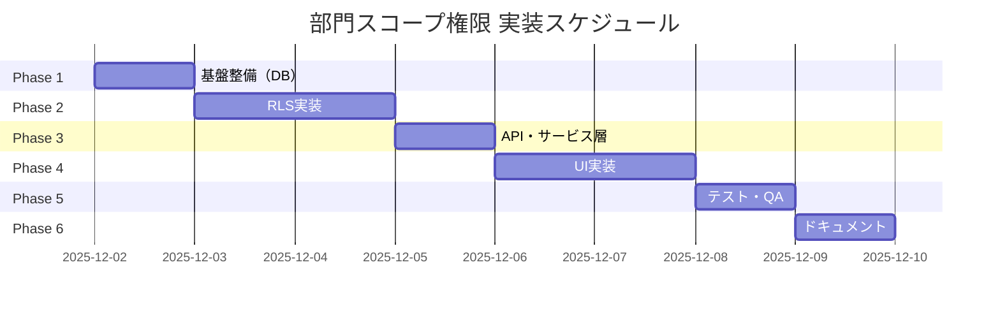

作成日: 2025-12-01
更新日: 2025-12-01
記録者: Claude Code (Opus 4.5)

# 部門スコープ権限 実装計画書

## 概要

### 目的
組織内の部門単位でデータの閲覧・編集権限を制御し、中規模以上の顧客が求めるセキュリティ要件を満たす。

### ビジネス背景
- 中規模以上（100人以上）の企業では部門ごとに担当者が分かれている
- 他部門の機密情報を見せたくないというニーズがある
- ISMS認証の適用範囲を部門単位で区切るケースが多い
- **PO決定**: MVP前に実装必須（中規模以上顧客の契約要件）

### 現状の課題
現在のシステムは「組織単位」でのみデータを区切っており、同一組織内の全メンバーが全データにアクセス可能。

### 目指す姿
```
┌─────────────────────────────────┐
│       株式会社ABC（組織）        │
├─────────┬───────────┬───────────┤
│ 営業部  │  経理部   │  開発部   │
│ ───────│───────────│─────────  │
│ 営業の  │  経理の   │  開発の   │
│ リスク  │  リスク   │  リスク   │
│ 文書    │  文書     │  文書     │
└─────────┴───────────┴───────────┘
```
- 一般ユーザー: 所属部門のデータのみ閲覧・編集可能
- 管理職: 自部門 + 配下部門のデータを閲覧・編集可能
- 組織管理者: 全部門のデータを閲覧・編集可能

---

## 関連ドキュメント・Issue

| リソース | 内容 |
|----------|------|
| `docs/02-project/01_roadmap.md` 未対応 #9 | 部門スコープRBACの元Issue |
| `docs/02-project/10_plan-tracking.md` 優先度B #4 | Plan Trackingでの進捗管理 |
| GitHub Issue #74 | 実装Issueトラッキング |
| `docs/03-architecture/rbac-design.md` | RBAC設計書（更新対象） |

---

## 実装フェーズ

### Phase 1: 基盤整備（DBスキーマ・マイグレーション）

**目標**: 部門スコープに必要なデータ構造を整備

#### 1.1 既存テーブルの確認
- [x] `organization_departments` テーブルの構造確認
- [x] 階層構造（`parent_department_id`）の確認

#### 1.2 スキーマ変更
- [x] `user_profiles` に `primary_department_id` カラム追加（所属部門）
- [x] `user_memberships` に `department_scope` カラム追加（権限範囲）
- [x] 各データテーブルに `department_id` カラム追加
  - [x] `risks`
  - [x] `documents`
  - [x] `tasks`
  - [x] `audit_checklists`（audit_findingsの代わり）

#### 1.3 マイグレーションファイル作成
```
supabase/migrations/
└── 2025XXXX_add_department_scope.sql
```

#### 完了条件
- [x] マイグレーションが `supabase db push` で正常適用
- [x] `npm run typecheck` がパス
- [x] 既存データに影響なし（NULL許容で追加）

---

### Phase 2: RLS（行レベルセキュリティ）実装

**目標**: 部門単位のアクセス制御をデータベースレベルで実現

#### 2.1 権限チェック関数の作成
```sql
-- ユーザーが特定部門のデータにアクセス可能か判定
CREATE FUNCTION user_can_access_department(
  user_id UUID,
  target_department_id UUID
) RETURNS BOOLEAN
```

#### 2.2 RLSポリシー更新（リスクテーブルから開始）
```sql
-- 既存ポリシー: organization_idのみ
-- 新ポリシー: organization_id AND department_id
ALTER POLICY "risks_select" ON risks
USING (
  organization_id = get_user_organization_id()
  AND (
    department_id IS NULL  -- 部門未設定は全員閲覧可
    OR user_can_access_department(auth.uid(), department_id)
    OR user_is_org_admin()
  )
);
```

#### 2.3 対象テーブルへの展開
- [x] `risks` - リスクテーブル
- [x] `documents` - 文書テーブル
- [x] `tasks` - タスクテーブル
- [x] `audit_checklists` - 監査チェックリストテーブル

#### 完了条件
- [x] 部門Aユーザーが部門Bのデータを取得できないことを確認（RLSポリシー適用）
- [x] 組織管理者は全部門のデータを取得可能
- [x] 部門未設定のデータは従来通りアクセス可能

---

### Phase 3: API・サービス層の更新

**目標**: フロントエンドからの操作に部門フィルタを適用

#### 3.1 サービス層の更新
```typescript
// lib/services/risk.ts
export async function listRisks(options?: {
  organizationId: string
  departmentId?: string  // 新規追加
  includeSubDepartments?: boolean  // 配下部門を含むか
}) { ... }
```

#### 3.2 対象サービス
- [x] `lib/services/risk.ts`
- [x] `lib/services/document.ts`
- [x] `lib/services/task.ts`
- [ ] `lib/services/audit.ts`（将来対応）

#### 3.3 新規作成時の部門設定
- [x] リスク作成時に `department_id` を設定可能に（型定義追加済み）
- [x] 文書作成時に `department_id` を設定可能に（型定義追加済み）
- [x] タスク作成時に `department_id` を設定可能に（型定義追加済み）

#### 完了条件
- [x] APIレスポンスが部門フィルタを反映
- [x] 新規作成データに `department_id` が正しく設定される

---

### Phase 4: UI実装

**目標**: ユーザーが部門を意識してデータを操作できるUIを提供

#### 4.1 共通コンポーネント
- [x] `DepartmentFilter` - 部門フィルタドロップダウン（`components/filters/DepartmentFilter.tsx`）
- [ ] `DepartmentSelector` - 部門選択フォームフィールド（将来対応）

#### 4.2 一覧画面への部門フィルタ追加
- [ ] `/risks` - リスク一覧（コンポーネント作成済み、統合は将来）
- [ ] `/documents` - 文書一覧（コンポーネント作成済み、統合は将来）
- [ ] `/tasks` - タスク一覧（コンポーネント作成済み、統合は将来）
- [ ] `/audit` - 監査画面（将来対応）

#### 4.3 作成・編集フォームへの部門選択追加
- [ ] リスク作成/編集モーダル（将来対応）
- [ ] 文書作成/編集画面（将来対応）
- [ ] タスク作成/編集モーダル（将来対応）

#### 4.4 翻訳キーの追加
```json
{
  "common": {
    "department": "部門",
    "allDepartments": "全部門",
    "selectDepartment": "部門を選択",
    "myDepartment": "自部門のみ",
    "includingSubDepartments": "配下部門を含む"
  }
}
```

#### 完了条件
- [ ] 部門フィルタが全一覧画面で動作（コンポーネント作成済み）
- [ ] 新規作成時に部門を選択可能（将来対応）
- [ ] URLクエリパラメータと連動（`?department=xxx`）（将来対応）

---

### Phase 5: テスト・QA

**目標**: 部門スコープが正しく機能することを網羅的に検証

#### 5.1 テストシナリオ
| # | シナリオ | 期待結果 |
|---|----------|----------|
| 1 | 部門Aユーザーがリスク一覧を表示 | 部門Aのリスクのみ表示 |
| 2 | 部門Aユーザーが部門Bのリスク詳細にアクセス | 403エラー |
| 3 | 組織管理者がリスク一覧を表示 | 全部門のリスクが表示 |
| 4 | 部門フィルタで「全部門」を選択（管理者） | 全データ表示 |
| 5 | 部門未設定のリスクにアクセス | 従来通りアクセス可能 |
| 6 | 新規リスク作成時に部門を設定 | 設定した部門でデータ作成 |

#### 5.2 Playwrightテスト
```
tests/e2e/
└── department-scope.spec.ts  ✅ 作成済み
```

#### 5.3 QAスクリプト
```bash
npm run qa:department-scope  # 将来追加
```

#### 完了条件
- [x] E2Eテストファイル作成済み
- [ ] 全テストシナリオがパス（統合後に実行）
- [ ] Playwrightテストが成功（統合後に実行）
- [x] 既存テストが壊れていない

---

### Phase 6: ドキュメント・リリース準備

**目標**: 運用ドキュメントを整備し、リリース可能な状態にする

#### 6.1 ドキュメント更新
- [ ] `docs/03-architecture/rbac-design.md` - 部門スコープ追記
- [ ] `docs/06-operations/development-environment-guide.md` - 部門テスト手順
- [ ] `docs/02-project/10_plan-tracking.md` - 完了マーク

#### 6.2 マイグレーション手順書
既存環境への適用手順を明文化

#### 6.3 リリースノート
```markdown
## 新機能: 部門スコープ権限
- 部門単位でのデータアクセス制御が可能に
- 一覧画面に部門フィルタを追加
- 詳細は [ドキュメント] を参照
```

#### 完了条件
- [ ] 全ドキュメントが更新済み
- [ ] Plan Tracking #4 に完了マーク

---

## 実装順序とスケジュール目安



**見積もり合計**: 約7〜8日（1人で実施の場合）

---

## リスクと対策

| リスク | 影響度 | 対策 |
|--------|--------|------|
| 既存データとの互換性 | 高 | `department_id` はNULL許容で追加、段階的移行 |
| RLSパフォーマンス低下 | 中 | インデックス追加、クエリ最適化 |
| UIの複雑化 | 中 | 部門フィルタはオプショナル表示、デフォルトは「自部門」 |
| テスト工数増加 | 中 | 権限マトリクスを整理し、自動テストでカバー |

---

## 次のアクション

1. **Phase 1 着手**: DBスキーマ設計とマイグレーション作成
2. **依存確認**: `organization_departments` の既存データ確認
3. **設計レビュー**: RLSポリシーの設計をPOと確認

---

## 更新履歴

| 日付 | 内容 | 担当 |
|------|------|------|
| 2025-12-01 | 初版作成 | Claude Code |
| 2025-12-01 | Phase 1-5 実装完了（基盤実装） | Claude Code |
