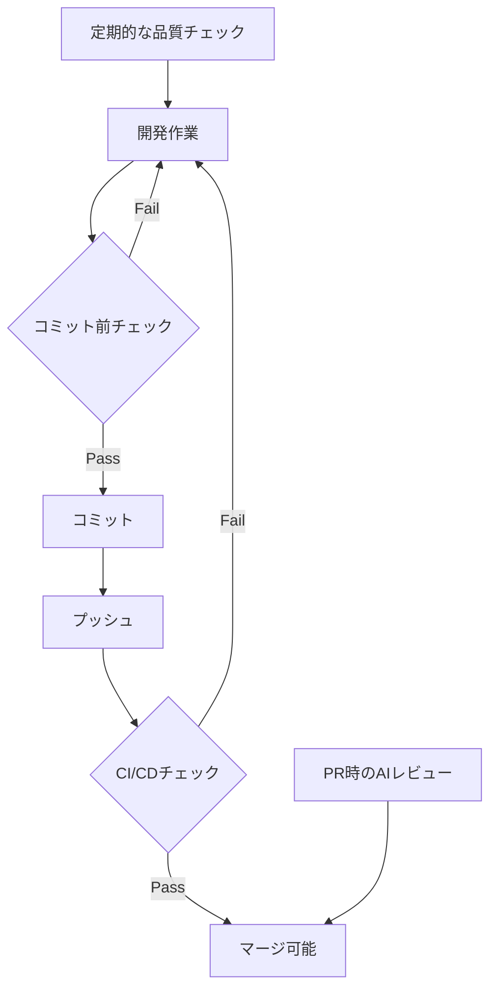

# Next.js/TypeScriptプロジェクト品質向上ガイド

このドキュメントは、Next.js/TypeScriptプロジェクトで実装されている品質向上手法をまとめたものです。他のプロジェクトでも同様の品質管理体制を構築できるよう、実装手順と設定内容を詳細に記載しています。

## 目次
1. [概要](#概要)
2. [品質向上の全体像](#品質向上の全体像)
3. [自動テストシステムの構築](#自動テストシステムの構築)
4. [Git Hooksによる品質チェック](#git-hooksによる品質チェック)
5. [ESLint設定](#eslint設定)
6. [CI/CDパイプライン](#cicdパイプライン)
7. [品質基準と運用ルール](#品質基準と運用ルール)
8. [導入手順](#導入手順)

## 概要

本手法は以下の観点で品質向上を実現します：
- **予防的アプローチ**: Git Hooksによるコミット前チェック
- **継続的検証**: 開発中の定期的なテスト実行
- **自動化**: CI/CDパイプラインでの品質チェック
- **標準化**: コーディング規約とレビュー基準の明確化

## 品質向上の全体像



### 抜けやすい観点を仕組みに組み込む
- **API 契約確認**: 依存 API のレスポンス例をスナップショット化し、フロント変更時に差分を確認する。自動比較できる場合は Playwright/CLI で JSON を突き合わせ、結果をエビデンスとして残す。
- **ビジュアルリグレッション**: 主要画面だけでもスクリーンショット比較を導入し、UI 変更が意図どおりかを検証する。
- **レスポンシブ確認**: PC/タブレット/スマホの 3 ビューで主要導線をチェックする作業を PR 前の標準タスクに入れる。
- **テストデータ管理**: シード手順と接続先環境をユースケース Plan に必ず書き、`--dry-run` の有無も明示する。
- **障害復旧スモーク**: ロールバック直後に回す最小限のルート（例: 3 画面）のスモークテストをコマンド化または手順化する。
- **継続計測/監視確認**: Lighthouse・脆弱性スキャンに加え、必要に応じて軽負荷試験や監視アラートの動作確認を定期タスクに組み込む。

## 自動テストシステムの構築

### 1. テストスクリプトの配置
`scripts/`ディレクトリに以下のテストスクリプトを配置します。

#### test-all-quality.js (統合テストランナー)
```javascript
#!/usr/bin/env node
const { spawn } = require('child_process');
const path = require('path');

const TEST_SCRIPTS = [
  {
    name: 'TypeScript/構文エラーテスト',
    script: 'test-typescript-errors.js',
    description: 'TypeScript型チェック、ESLint、ビルドテスト、未定義変数検出'
  },
  {
    name: '未定義アイコン検出テスト',
    script: 'test-undefined-icons.js',
    description: 'lucide-reactアイコンの未定義使用とインポート漏れの検出'
  },
  {
    name: 'コンポーネント完全性テスト',
    script: 'test-component-completeness.js',
    description: 'useState/useEffect宣言漏れ、イベントハンドラ実装漏れの検出'
  },
  {
    name: '全ページHTTPステータステスト',
    script: 'test-all-pages.js',
    description: 'すべてのページが正常に表示されるか確認'
  },
  {
    name: '無効パス404チェック',
    script: 'test-invalid-paths.js',
    description: '存在しないパスが適切に404を返すか確認'
  },
  {
    name: 'HTML構造検証',
    script: 'test-html-structure.js',
    description: 'HTMLの基本構造とメタデータを検証'
  }
];

// 各テストを順番に実行
async function main() {
  console.log('品質保証テスト一括実行\n');
  
  const results = [];
  for (const test of TEST_SCRIPTS) {
    const scriptPath = path.join(__dirname, test.script);
    
    try {
      const result = await runTest(scriptPath, test.name);
      results.push(result);
    } catch (error) {
      console.error(`エラー: ${test.name}`, error);
      results.push({ name: test.name, success: false, error: error.message });
    }
  }
  
  // 結果サマリー表示
  const failureCount = results.filter(r => !r.success).length;
  if (failureCount > 0) {
    console.log(`\n⚠️  ${failureCount}個のテストが失敗しました。`);
    process.exit(1);
  } else {
    console.log('\n✅ すべてのテストが成功しました！');
  }
}

function runTest(scriptPath, testName) {
  return new Promise((resolve) => {
    console.log(`\n実行中: ${testName}`);
    
    const child = spawn('node', [scriptPath], {
      stdio: 'inherit',
      cwd: process.cwd()
    });
    
    child.on('close', (code) => {
      resolve({ name: testName, success: code === 0 });
    });
  });
}

main().catch(console.error);
```

### 2. 主要テストスクリプトの実装

#### test-typescript-errors.js
```javascript
#!/usr/bin/env node
const { execSync } = require('child_process');
const fs = require('fs');
const path = require('path');

console.log('TypeScript/構文エラーテスト\n');

// TypeScript型チェック
try {
  console.log('=== TypeScript型チェック ===');
  execSync('npx tsc --noEmit', { stdio: 'inherit' });
  console.log('✅ TypeScript型チェック: 成功\n');
} catch (error) {
  console.error('❌ TypeScript型チェック: 失敗\n');
  process.exit(1);
}

// ESLintチェック
try {
  console.log('=== ESLintチェック ===');
  execSync('npm run lint', { stdio: 'inherit' });
  console.log('✅ ESLintチェック: 成功\n');
} catch (error) {
  console.error('❌ ESLintチェック: 失敗\n');
  process.exit(1);
}

// ビルドテスト
try {
  console.log('=== ビルドテスト ===');
  execSync('npm run build', { stdio: 'inherit' });
  console.log('✅ ビルドテスト: 成功\n');
} catch (error) {
  console.error('❌ ビルドテスト: 失敗\n');
  process.exit(1);
}
```

#### test-undefined-icons.js
```javascript
#!/usr/bin/env node
const fs = require('fs');
const path = require('path');

console.log('未定義アイコン検出テスト\n');

// lucide-reactのインポートパターン
const importRegex = /import\s*{([^}]+)}\s*from\s*['"]lucide-react['"]/g;
const iconUsageRegex = /<(\w+)\s+(?:[^>]*\s)?(?:icon|className|size|strokeWidth|color)/g;

let hasErrors = false;

function scanFile(filePath) {
  const content = fs.readFileSync(filePath, 'utf8');
  
  // インポートされているアイコンを抽出
  const imports = new Set();
  let match;
  while ((match = importRegex.exec(content)) !== null) {
    const icons = match[1].split(',').map(icon => icon.trim());
    icons.forEach(icon => imports.add(icon));
  }
  
  // 使用されているアイコンを抽出
  const used = new Set();
  while ((match = iconUsageRegex.exec(content)) !== null) {
    used.add(match[1]);
  }
  
  // 未定義アイコンの検出
  const undefined = [...used].filter(icon => !imports.has(icon));
  const unused = [...imports].filter(icon => !used.has(icon));
  
  if (undefined.length > 0 || unused.length > 0) {
    console.log(`❌ ${path.relative(process.cwd(), filePath)}`);
    if (undefined.length > 0) {
      undefined.forEach(icon => console.log(`   ⚠️  未定義アイコン: ${icon}`));
    }
    if (unused.length > 0) {
      console.log(`   📦 未使用: ${unused.join(', ')}`);
    }
    hasErrors = true;
  }
}

// srcディレクトリをスキャン
function scanDirectory(dir) {
  const files = fs.readdirSync(dir);
  
  for (const file of files) {
    const filePath = path.join(dir, file);
    const stat = fs.statSync(filePath);
    
    if (stat.isDirectory() && !file.startsWith('.')) {
      scanDirectory(filePath);
    } else if (file.endsWith('.tsx') || file.endsWith('.jsx')) {
      scanFile(filePath);
    }
  }
}

scanDirectory(path.join(process.cwd(), 'src'));

if (hasErrors) {
  console.log('\n🔧 修正方法:');
  console.log('1. lucide-reactからアイコンをインポートしてください');
  console.log('2. import { Plus } from "lucide-react" を追加');
  console.log('3. 使用しないアイコンはインポートから削除してください');
  process.exit(1);
} else {
  console.log('✅ すべてのアイコンが正しくインポートされています');
}
```

## Git Hooksによる品質チェック

### Huskyのセットアップ
```bash
npm install --save-dev husky
npx husky install
npx husky add .husky/pre-commit "npm run lint"
```

### .husky/pre-commit
```bash
#!/usr/bin/env sh
. "$(dirname -- "$0")/_/husky.sh"

# ESLintチェック
echo "🔍 ESLintチェックを実行中..."
npm run lint

# TypeScriptチェック（オプション）
echo "🔍 TypeScriptチェックを実行中..."
npx tsc --noEmit

# テストの実行（オプション）
# echo "🧪 テストを実行中..."
# npm test
```

## ESLint設定

### eslint.config.mjs
```javascript
import path from "node:path";
import { fileURLToPath } from "node:url";
import js from "@eslint/js";
import { FlatCompat } from "@eslint/eslintrc";

const __filename = fileURLToPath(import.meta.url);
const __dirname = path.dirname(__filename);
const compat = new FlatCompat({
  baseDirectory: __dirname,
  recommendedConfig: js.configs.recommended,
  allConfig: js.configs.all
});

export default [
  ...compat.extends("next/core-web-vitals", "next/typescript"),
  {
    rules: {
      // 命名規則
      "@typescript-eslint/naming-convention": ["error", {
        selector: "variable",
        format: ["camelCase", "PascalCase", "UPPER_CASE"],
        leadingUnderscore: "allow"
      }],
      
      // 未使用変数の警告（_で始まるものは除外）
      "@typescript-eslint/no-unused-vars": ["warn", {
        argsIgnorePattern: "^_",
        varsIgnorePattern: "^_"
      }],
      
      // any型の使用を警告
      "@typescript-eslint/no-explicit-any": "warn",
      
      // console.logの警告（warn/errorは許可）
      "no-console": ["warn", { allow: ["warn", "error"] }],
      
      // その他の推奨設定
      "no-debugger": "error",
      "no-alert": "warn",
      "prefer-const": "error",
      "no-var": "error"
    }
  }
];
```

## CI/CDパイプライン

### GitHub Actions設定例
```yaml
name: Quality Check

on:
  pull_request:
    branches: [ main, develop ]
  push:
    branches: [ main ]

jobs:
  quality-check:
    runs-on: ubuntu-latest
    
    steps:
    - uses: actions/checkout@v3
    
    - name: Setup Node.js
      uses: actions/setup-node@v3
      with:
        node-version: '18'
        cache: 'npm'
    
    - name: Install dependencies
      run: npm ci
    
    - name: Run ESLint
      run: npm run lint
    
    - name: Run TypeScript check
      run: npx tsc --noEmit
    
    - name: Run build test
      run: npm run build
    
    - name: Run quality tests
      run: node scripts/test-all-quality.js
```

## 品質基準と運用ルール

### 開発時のチェックリスト
1. **コミット前**
   - ESLintエラーゼロ
   - TypeScriptエラーゼロ
   - ビルド成功

2. **機能追加時**
   - 該当画面のHTTPステータステスト
   - コンポーネント完全性テスト
   - 未定義変数・アイコンチェック

3. **PR作成前**
   - 全品質テスト実行 (`node scripts/test-all-quality.js`)
   - ビルド成功確認
   - パフォーマンステスト（初回ロード2秒以内）

### パフォーマンス基準
- 初回ロード: 2秒以内
- ルート遷移: 200ms以内
- APIレスポンス: 500ms以内

### コード品質基準
- TypeScript厳格モード使用
- any型の使用は最小限
- 適切なエラーハンドリング
- コンポーネントの責務分離

## 導入手順

### 1. 必要なパッケージのインストール
```bash
npm install --save-dev husky @typescript-eslint/parser @typescript-eslint/eslint-plugin
```

### 2. テストスクリプトのコピー
1. `scripts/`ディレクトリを作成
2. 上記のテストスクリプトをコピー
3. 実行権限を付与: `chmod +x scripts/*.js`

### 3. ESLint設定
1. `eslint.config.mjs`をプロジェクトルートに配置
2. `package.json`にlintスクリプトを追加:
   ```json
   {
     "scripts": {
       "lint": "next lint",
       "lint:fix": "next lint --fix"
     }
   }
   ```

### 4. Git Hooksの設定
```bash
npx husky install
npx husky add .husky/pre-commit "npm run lint"
```

### 5. CI/CD設定
1. `.github/workflows/`ディレクトリを作成
2. 上記のGitHub Actions設定をコピー

### 6. 品質ガイドラインの策定
1. `docs/qa-guidelines.md`を作成
2. チーム内で品質基準を共有

## トラブルシューティング

### よくある問題と解決方法

1. **ESLintエラーが大量に出る場合**
   ```bash
   npm run lint:fix  # 自動修正可能なものを修正
   ```

2. **TypeScriptエラーが解決できない場合**
   - `tsconfig.json`の設定を確認
   - 型定義ファイルの不足をチェック

3. **ビルドエラーが発生する場合**
   - `node_modules`を削除して再インストール
   - Next.jsのバージョン互換性を確認

## まとめ

この品質向上システムにより、以下の効果が期待できます：
- バグの早期発見と修正コストの削減
- コード品質の標準化と保守性の向上
- チーム全体の生産性向上
- リリース品質の安定化

継続的な品質改善のため、定期的にテストスクリプトを見直し、新しい問題パターンに対応していくことが重要です。
