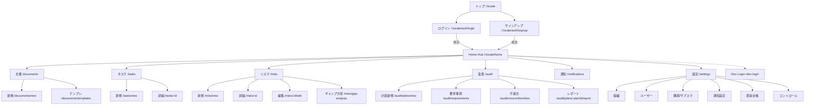
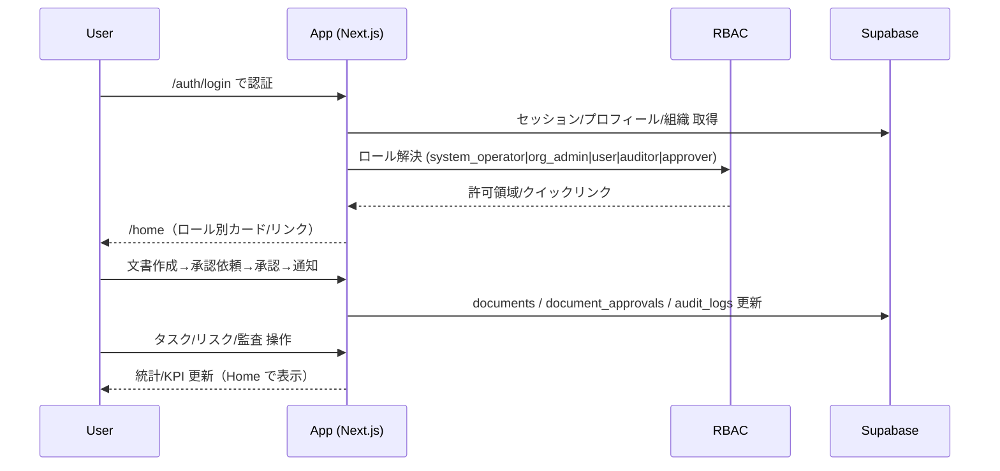
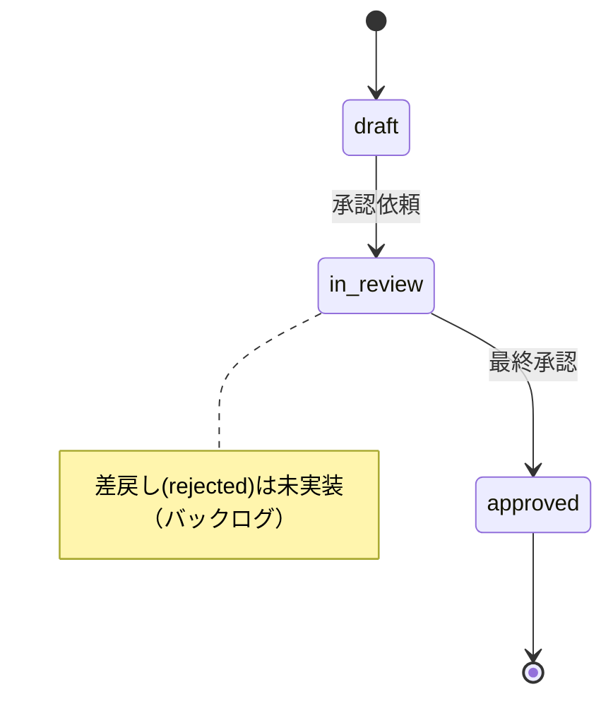
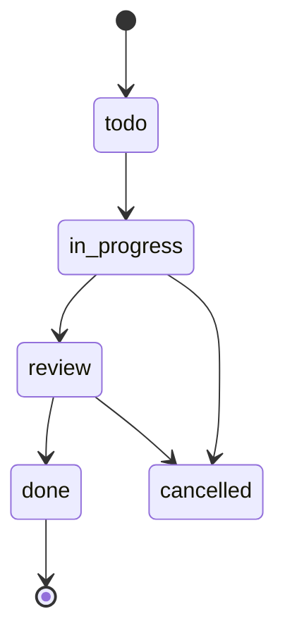
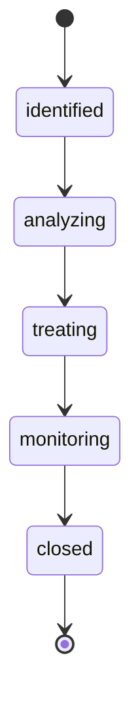
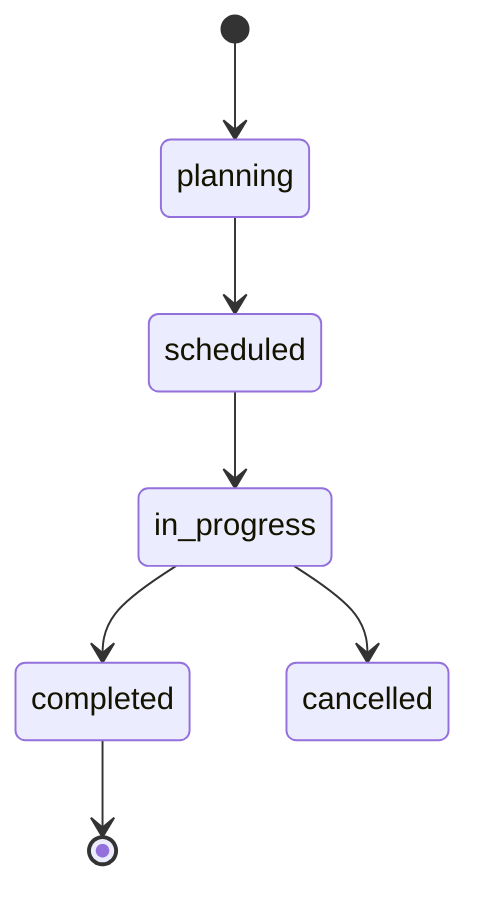
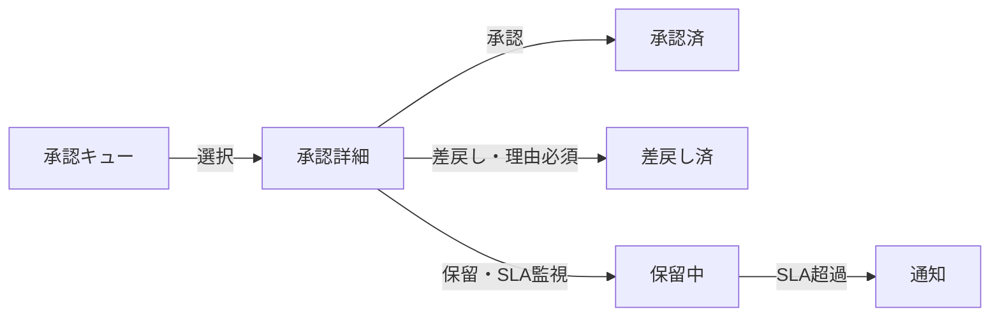

# 画面インベントリと遷移マップ

本ドキュメントは以下を目的に作成しています（例示ではなく本プロジェクトの現状に適合）。

- ロール別ユースケース/KPI から必要画面と主要CTAを逆算し、画面一覧を確定する。
- SSO→ロール別ダッシュボード→主要機能（文書・タスク・リスク・監査・通知・設定）のエンドツーエンド遷移を可視化する。
- RBAC 分岐・URL・Next.js ルーティング（`app/[locale]/...`）・状態（Loading/Empty/Error/Success）を明文化する。
- 実装フェーズ（A:基盤/B:ビジュアル/C:テスト&アクセシビリティ）と既存バックログ（tasks.json 他）の完了条件を結線する。

注意:
- 実装上のロールは `system_operator | org_admin | user | auditor | approver`（`lib/dev-login/scenarios.ts`）。
- 本プロジェクトでは HR/経理等のロール画面は未実装のため、本書では採用しません（将来拡張は別途検討）。

## 0. 調査サマリー（現状の主な画面）

- グローバル/認証: `/:locale`（LP/リダイレクト）, `/:locale/auth/login`, `/:locale/auth/signup`, `/:locale/auth/verify-email`, `/:locale/dev-login`
- Home（共通ハブ）: `/:locale/home`（ロール認識・統計・通知プレビュー・クイックリンク）
- 文書: `/:locale/documents`（一覧/フォルダ/バージョン/承認モーダル/アップロード）, `/:locale/documents/new`（エディタ: draft/in_review）, `/:locale/documents/templates`
- タスク: `/:locale/tasks`（一覧/フィルタ/CSV）, `/:locale/tasks/new`, `/:locale/tasks/[id]`
- リスク: `/:locale/risks`（一覧+マトリクス/XLS）, `/:locale/risks/new`, `/:locale/risks/[id]`, `/:locale/risks/[id]/edit`, `/:locale/risks/gap-analysis`
- 監査: `/:locale/audit`（計画/レポート導線）, `/:locale/audit/plans/new`, `/:locale/audit/requirements`, `/:locale/audit/nonconformities`, `/:locale/audit/plans/[planId]/report`
- 通知: `/:locale/notifications`, 設定: `/:locale/settings/{organization,users,subscription,notifications,assets,controls,profile}`

参考コード位置: app/[locale] 配下各ページ、lib/services/*（Document/Task/Risk/Audit/Notification ほか）

## 1. 役割ごとのユースケースと KPI

本プロジェクトのロール（`lib/dev-login/scenarios.ts`）を前提に、現状実装されている機能に紐づく KPI を定義します。

### system_operator（システム運営）
- 目的: 組織横断の設定/ポリシー/台帳の整備。
- 主要タスク: 組織/ユーザー/コントロール/資産の初期設定、監査全体の可視化。
- KPI: 設定未完了項目数、監査進捗の遅延率、重大リスク件数。

### org_admin（組織管理者）
- 目的: 日々の運用とメンバー管理、契約/請求の維持。
- 主要タスク: 文書の作成/承認依頼、タスク配賦、リスク登録、ユーザー/サブスク管理。
- KPI: 文書承認リードタイム、タスクの期限超過率、リスククローズ率、請求関連の異常件数。

### approver（承認者）
- 目的: 文書承認とレビューのスループット最大化。
- 主要タスク: 自分宛の承認（in_review）処理、レビューコメント。
- KPI: 1日あたり承認処理件数、未処理キュー滞留時間、再提出率。

### auditor（監査担当）
- 目的: 監査計画・不適合管理・レポート作成。
- 主要タスク: 計画作成、要求事項選定、是正処置フォロー、レポート作成/PDF出力。
- KPI: 計画→完了までのサイクルタイム、不適合の再発率、レポート提出遅延率。

### user（一般）
- 目的: 自分のタスクの完了、必要文書の参照。
- 主要タスク: タスク処理、文書検索/ダウンロード。
- KPI: タスク完了率、遅延件数、自分へのレビュー依頼対応時間。

## 2. RBAC とロール別ダッシュボード割当

- 認可は Supabase 関数（`get_user_role()`, `user_has_role()`）とアプリ側の PermissionService/保護フックで二層防御。
- Home Hub はロール認識済み（`lib/home/roleHomeConfig.ts`）。現状クイックリンクは以下の通り（実装実態に合わせて補正）。

| ロール | 既定リンク（現状） | 実装との整合性 | 補正提案 |
| --- | --- | --- | --- |
| system_operator | `/settings/organization`, `/settings/security` | `settings/security` は未実装 | `/settings/controls` へ置換、必要なら `/settings/assets` を追加 |
| org_admin | `/settings/users`, `/settings/subscription`, `/documents` | OK | 必要に応じ `/tasks` を追加 |
| approver | `/documents?status=in_review`, `/tasks?status=review` | OK | ドキュメント詳細画面が無い点はモーダルで代替（後述） |
| auditor | `/audit`, `/tasks?status=review` | OK | `/audit/plans/new` も補助リンクに追加可 |
| user | `/tasks`, `/documents` | OK | 文書は既定で参照主体 |

バックログ: `roleHomeConfig` の system_operator リンク補正（security→controls）。

## 3. 画面インベントリ（URL / Next.js パス / 主要機能）

凡例: [A/B/C] は実装フェーズ。A=スタイリング基盤, B=ビジュアル強化, C=テスト/アクセシビリティ。

### 3.1 未ログイン領域
- トップ（LP/リダイレクト）: `/:locale` → `app/page.tsx` or `app/[locale]/page.tsx`
  - CTA（ログイン/サインアップ）/ プラン訴求（任意）
- ログイン: `/:locale/auth/login`
  - メール/パス/SSO ボタン、エラー表示、成功後ロール別 `/home` リダイレクト
- サインアップ/招待/メール確認: `/:locale/auth/signup`, `/:locale/auth/verify-email`, `/:locale/auth/invite`
- Dev ログイン（QA用）: `/:locale/dev-login`（ロール切替・パーミッション調整）

### 3.2 ログイン後ハブ
- Home Hub: `/:locale/home`
  - ロールバッジ・プラン/請求・統計カード（ユーザー/文書/リスク/タスクなど）
  - 通知プレビュー、クイックリンク（ロール別）
  - 失敗時フェールセーフ表示（tasks.json: qa-home-failsafe-check にてQA対象）

### 3.3 機能領域
- 文書: `/:locale/documents`（一覧/フォルダ/バージョン/アップロード/承認依頼・承認モーダル）, `/:locale/documents/new`, `/:locale/documents/templates`
  - 文字数上限: title 120 / description 500 / content 4000（`documents/new`）
  - ステータス: `draft` → `in_review` → `approved`（reject は未実装）
  - エクスポート: `/api/documents/:id/export?format=pdf|word`
- タスク: `/:locale/tasks`, `/:locale/tasks/new`, `/:locale/tasks/[id]`
  - ステータス: `todo|in_progress|review|done|cancelled`、CSV エクスポート、コメント/添付/タグ/履歴
- リスク: `/:locale/risks`, `/:locale/risks/new`, `/:locale/risks/[id]`, `/:locale/risks/[id]/edit`, `/:locale/risks/gap-analysis`
  - ステータス: `identified|analyzing|treating|monitoring|closed`、マトリクス表示、XLS エクスポート
- 監査: `/:locale/audit`, `/:locale/audit/plans/new`, `/:locale/audit/requirements`, `/:locale/audit/nonconformities`, `/:locale/audit/plans/[planId]/report`
  - 計画作成/要求事項選定/不適合と是正処置/レポート編集と PDF 出力
- 通知: `/:locale/notifications`（タイプ別: task_reminder/document_approval/audit_schedule/risk_alert/system）
- 設定: `/:locale/settings/{organization,users,subscription,notifications,assets,controls,profile}`
  - Stripe 連携: `pricing` 画面、Billing Portal セッション作成、webhook QA（tasks.jsonの uc-02）

## 4. サイトマップ / 画面遷移（Mermaid）

### 4.1 サイトマップ（未ログイン → ハブ → 詳細）

### 4.2 ウォーキングスケルトン（エンドツーエンド）

### 4.3 申請オブジェクトの状態遷移

### 4.5 タスク状態遷移（lib/services/task.ts）

### 4.6 リスク状態遷移（lib/services/risk.ts）

### 4.7 監査計画/レポート（抜粋）

### 4.4 ロール別フロー（例: 上長/承認者）

## 5. 画面仕様（要点）

各画面は以下を必須で持つ。

- 状態: Loading/Empty/Error/Success（トースト/バナーのパターン統一）
- ナビゲーション: パンくず/サイドバー/ヘッダー（ダッシュボードシェル共通）
- 国際化: `messages/*.json` のキー定義（`nav.*`, `home.*`, `documents.*`, `tasks.*`, `risks.*`, `audit.*`, `settings.*`）
- データ契約: 入出力スキーマ、ページネーション、ソート/フィルタ（URLクエリ同期）
- 監査ログ: 重要操作（承認/差戻し/精算/配布）の履歴を記録
- 通知センター (`/[locale]/notifications`): DashboardLayout/サイドバー/パンくず/SkipLink/NotificationBell/ユーザーメニューを共有し、`/[locale]/settings/notifications` との遷移でもヘッダーが残ることを必須要件とする

### Dev Login テナントセレクタ（`/[locale]/dev-login`）

- レイアウト: 左ペインはロールカード（6件）で、右ペインに認証情報・権限トグル・テナントセレクタと CTA を縦積みする 2 カラム構成。
- データソース:
  - 既定テナント: `lib/dev-login/scenarios.ts` の `ROLE_SCENARIOS` からロールごとに 1 件ずつ収集。
  - 追加テナント: `/api/dev/organizations` が Supabase `organizations` テーブルから最新 100 件 (`MAX_ORGANIZATION_RESULTS`) を取得し、`updated_at` の降順で返却。
- セレクタ: `<select id="tenant-select">` に「名称 · プラン / ステータス」を表示し、`super_admin` など紐付け不要なロールでは `noTenantOption` を先頭に表示する。
- 永続化: 選択結果は `localStorage` の `dev-login:organization-overrides`（`DEV_LOGIN_ORGANIZATION_STORAGE_KEY`）に `Record<RoleKey, RoleScenarioOrganization>` 形式で保存され、ロール単位で独立して復元される。
- サマリーカード: セレクタ下部に現在のテナント名/プラン/ステータス/ID を表示し、`Reset` ボタンでデフォルトシナリオへ戻す。Super Admin は `null` を許可し、「テナントに紐付けずにログイン」を再現する。
- ログ/遷移: `/api/dev/login` へ送信する payload には `organizationId` が含まれ、リダイレクト先 URL へ `?from=dev-login&role={role}` を付与する（監査証跡と QA スクリプトがこのフラグで Dev Login 経由を識別）。
- エラーハンドリング: `/api/dev/organizations` の失敗時は赤バナーで `tenantSelector.loadError` を表示し、`organizationStatusMessage` にバックエンドからの文言（例: 502 / 404）を追記する。`/api/dev/login` の失敗はフォーム下部の赤バナーに表示。

| 状態 | 表示 | 発火条件 |
| --- | --- | --- |
| loading | インディゴのテキスト「取得中…」をセレクタ下に表示 | `/api/dev/organizations` のフェッチ開始時 |
| error | 赤テキスト + サーバーメッセージを表示、既存オプションは fallback | API レスポンスコード 4xx/5xx |
| persistHint | `tenantSelector.persistHint` を常時表示し、ローカル保存される旨を明示 | ロール問わず常時 |
| summary-card(empty) | 「テナント未選択」の説明 + `noTenantOption` | `super_admin` など `RoleScenario.organization=null` |
| summary-card(selected) | 名称/plan/status/ID（`<code>`） | デフォルト or override が存在する時 |

QA ノート:
- Dev Login でテナントを切り替えてから CTA を押すと、`/api/dev/login` が Supabase へ `organizations` UPSERT → `auth.admin.createUser` を実行し、`organizationId` をログへ残す。Playwright では `?from=dev-login` をアサートする。
- ブラウザストレージが壊れた場合は `localStorage.removeItem('dev-login:organization-overrides')` を実行して初期値に戻す。`sanitizeOverridesFromStorage` が plan/status をホワイトリストで検証するため、未知の値は UI に復元されない。

## 6. URL と Next.js ルーティング対応（抜粋・現状準拠）

- `/:locale/home` → `app/[locale]/home/page.tsx`（既存）
- 既存: `/:locale/home`, `/:locale/documents`, `/:locale/documents/new`, `/:locale/documents/templates`
- 既存: `/:locale/tasks`, `/:locale/tasks/new`, `/:locale/tasks/[id]`
- 既存: `/:locale/risks`, `/:locale/risks/new`, `/:locale/risks/[id]`, `/:locale/risks/[id]/edit`, `/:locale/risks/gap-analysis`
- 既存: `/:locale/audit`, `/:locale/audit/plans/new`, `/:locale/audit/requirements`, `/:locale/audit/nonconformities`, `/:locale/audit/plans/[planId]/report`
- 既存: `/:locale/notifications`, `/:locale/settings/*`
- 提案（バックログ）: 文書詳細 `/:locale/documents/[id]`（モーダルからページへ昇格）

## 7. 実装フェーズ割付（A/B/C・現状タスク接続）

- フェーズA（基盤）: 既存画面の状態/エラー統一、RBACガード最小実装、リンク結線の欠落解消
- フェーズB（ビジュアル）: Home 統計カード/通知 UI 改善、文書/リスク表の視認性改善、チャート導入（任意）
- フェーズC（テスト&アクセシビリティ）: Playwright/E2E 整備、Axe/Lighthouse、フォーカス管理・ショートカット・i18n網羅

接続タスク（tasks.json 抜粋）
- uc-05-risk-matrix-automation: リスクマトリクス DOM 自動検証（E2E/QA）
- qa-home-failsafe-check: ホーム統計失敗時フェールセーフの検証
- uc-02-billing-portal-webhook-qa: Billing Portal 変更/キャンセルと Webhook 異常系 QA

## 8. バックログ連携と完了条件（抜粋）

- Home Hub フェールセーフ QA（tasks.json: qa-home-failsafe-check）
  - DoD: 失敗時の警告/占位表示/リンクが仕様通り。手順/証跡を docs/05-quality に追記。
- リスクマトリクス自動検証（tasks.json: uc-05-risk-matrix-automation）
  - DoD: 3解像度で DOM/色/凡例検証できるスクリプト（CI 連携可）。
- Billing Portal/Webhook QA（tasks.json: uc-02-billing-portal-webhook-qa）
  - DoD: 手順/結果/ログの整備と docs の反映。
- roleHomeConfig 補正（system_operator の `/settings/security` → `/settings/controls`）
  - DoD: リンク修正・i18n キー確認・Playwright ルート遷移更新。
- 文書詳細ページの新設（任意）
  - DoD: URL 直叩き対応、バージョン/承認履歴/ダウンロードの集約、既存モーダルから遷移導線。

## 9. E2E/Playwright シナリオ（雛形）

- `e2e/auth-login.spec.ts`: ログイン→/home 到達、ロールバッジ/クイックリンク確認
- `e2e/documents-approval.spec.ts`: 新規作成→承認依頼（step1/2）→承認完了→通知
- `e2e/tasks.spec.ts`: 作成→ステータス遷移（todo→in_progress→review→done）→CSV エクスポート
- `e2e/risks-matrix.spec.ts`: マトリクス色/閾値/凡例 DOM 検証（uc-05）
- `e2e/audit-report.spec.ts`: 計画新規→レポート編集→PDF ダウンロード
- `e2e/home-failsafe.spec.ts`: 統計取得失敗のフェールセーフ表示（qa-home）

## 10. メトリクス/KPI 実装の指針

- 追跡イベント（例）: `document.created/approval_requested/approved`, `task.created/status_changed`, `risk.created/updated`, `audit.plan_created/report_exported`
- ダッシュボード反映: Home の統計カードへ集約（RLS 下のビュー or サマリー RPC）。フェールセーフ時は警告とキャッシュ値を表示。

## 11. アクセシビリティ/国際化

- 重要操作（承認/差戻し/精算/配布）はボタンに `aria-label` と確認モーダルを付与。
- 翻訳キーは名前空間付きで追加（例: `documents.editor.submit_review`, `tasks.list.status.review`, `audit.report.actions.downloadPdf`）。`en/ja` 同時更新。

## 12. 付録: 主要 CTA とリンク結線（抜粋）

- Home Hub → `quickLinks`: 文書/タスク/リスク/監査/設定（ロール別に最適化）
- 文書一覧 → 承認モーダル/バージョン履歴/ダウンロード
- タスク一覧 → 詳細/コメント/タグ/CSV
- 監査 → 計画新規→レポート→PDF 出力

---

このドキュメントは UI 実装/QA の共通言語として運用し、変更時は本ファイルと対応する `messages/*.json` を同時に更新してください。
